# Laboratorio 5: Despliegue, Pruebas y Monitoreo de Modelos desde Azure Databricks

**Duración:** 1 hora

## Objetivo

Aprender a desplegar modelos de predicción de energía renovable entrenados en Databricks de forma segura y escalable, implementando estrategias de monitoreo y buenas prácticas para mantener modelos en producción.

**Caso de Uso:** Despliegue de modelo para predecir la producción de energía renovable (% de renovables) basado en características de consumo, población y desarrollo económico de países usando el dataset `owid-energy-data.csv`.

---

## Prerequisitos

- Laboratorio 4 completado (modelo de energía renovable registrado en MLflow)
- Azure Databricks workspace configurado
- Dataset `owid-energy-data.csv` disponible en DBFS
- Permisos para crear endpoints y recursos en Azure
- Familiaridad básica con APIs REST

---

## Parte 1: Tipos de Despliegue con Databricks y MLflow

### 1.1 Conceptos Fundamentales

#### Tipos de Despliegue

**1. Batch Scoring (Inferencia por Lotes)**
- Procesa grandes volúmenes de datos de forma periódica
- Ideal para predicciones no urgentes
- Ejecutado en clusters de Databricks
- Bajo costo operativo

**2. Real-time Endpoints (Inferencia en Tiempo Real)**
- Respuestas instantáneas a peticiones individuales
- Endpoints REST administrados
- Alta disponibilidad y escalabilidad automática
- Mayor costo por infraestructura dedicada

**3. Streaming Inference**
- Procesamiento continuo de datos en streaming
- Integración con Kafka, Event Hubs, etc.
- Latencia media entre batch y real-time

### 1.2 Comparación de Estrategias

| Característica | Batch Scoring | Real-time Endpoint | Streaming |
|----------------|---------------|-------------------|-----------|
| Latencia | Minutos/Horas | Milisegundos | Segundos |
| Volumen | Alto | Bajo-Medio | Continuo |
| Costo | Bajo | Alto | Medio |
| Complejidad | Baja | Media | Alta |
| Casos de uso | Reportes, ETL | Apps web, APIs | IoT, eventos |

---

## Parte 2: Batch Scoring - Predicciones por Lotes

### 2.1 Crear Notebook para Batch Scoring

Crea un nuevo notebook llamado `batch_scoring_demo`:

```python
# Databricks notebook source
# MAGIC %md
# MAGIC ## Batch Scoring con MLflow
# MAGIC Este notebook demuestra cómo realizar predicciones por lotes usando un modelo registrado en MLflow

# COMMAND ----------

import mlflow
import mlflow.pyfunc
from pyspark.sql import SparkSession
from pyspark.sql.functions import struct, col
import pandas as pd

# COMMAND ----------

# MAGIC %md
# MAGIC ### 1. Cargar Modelo desde MLflow Registry

# COMMAND ----------

# Configurar MLflow
mlflow.set_registry_uri("databricks")

# Nombre del modelo y versión
model_name = "renewable_energy_predictor"  # Modelo del Lab 4
model_version = 1  # O "Production" para usar el stage

# Cargar modelo
model_uri = f"models:/{model_name}/{model_version}"
print(f"Cargando modelo desde: {model_uri}")

loaded_model = mlflow.pyfunc.load_model(model_uri)
print(f"✓ Modelo de predicción de energía renovable cargado exitosamente")

# COMMAND ----------

# MAGIC %md
# MAGIC ### 2. Preparar Datos de Entrada (Dataset de Energía)

# COMMAND ----------

# Opción A: Crear datos de ejemplo para inferencia
# Features: year, population, gdp, primary_energy_consumption, fossil_fuel_consumption, renewables_consumption
sample_data = pd.DataFrame({
    'year': [2020, 2021, 2022, 2020, 2021],
    'population': [50000000, 51000000, 45000000, 52000000, 46000000],
    'gdp': [500000000000, 520000000000, 480000000000, 530000000000, 490000000000],
    'primary_energy_consumption': [1500, 1600, 1400, 1650, 1450],
    'fossil_fuel_consumption': [1200, 1250, 1100, 1300, 1150],
    'renewables_consumption': [300, 350, 300, 350, 300]
})

print(f"📊 Datos de ejemplo para batch scoring:")
print(f"   Países: {len(sample_data)}")
print(f"   Features: {list(sample_data.columns)}")

# Opción B: Cargar desde Delta Lake (datos procesados del Lab 3)
# df = spark.read.format("delta").load("/delta/energy_features")
# sample_data = df.select('year', 'population', 'gdp', 'primary_energy_consumption', 
#                         'fossil_fuel_consumption', 'renewables_consumption').limit(1000).toPandas()

display(sample_data)

# COMMAND ----------

# MAGIC %md
# MAGIC ### 3. Realizar Predicciones

# COMMAND ----------

# Predicciones con pandas DataFrame
predictions = loaded_model.predict(sample_data)

# Agregar predicciones al DataFrame
result_df = sample_data.copy()
result_df['prediction'] = predictions
result_df['prediction_timestamp'] = pd.Timestamp.now()

display(result_df)

# COMMAND ----------

# MAGIC %md
# MAGIC ### 4. Batch Scoring a Gran Escala con Spark UDF

# COMMAND ----------

from pyspark.sql.functions import pandas_udf, PandasUDFType
from pyspark.sql.types import DoubleType

# Crear Spark DataFrame
spark_df = spark.createDataFrame(sample_data)

# Definir UDF para predicciones distribuidas
@pandas_udf(DoubleType())
def predict_udf(*cols):
    # Reconstruir DataFrame desde columnas
    input_df = pd.concat(cols, axis=1)
    input_df.columns = sample_data.columns
    # Hacer predicción
    return pd.Series(loaded_model.predict(input_df))

# Aplicar predicciones
predictions_df = spark_df.withColumn(
    "prediction",
    predict_udf(*[col(c) for c in sample_data.columns])
)

display(predictions_df)

# COMMAND ----------

# MAGIC %md
# MAGIC ### 5. Guardar Resultados

# COMMAND ----------

# Guardar en Delta Lake
output_path = "/mnt/predictions/proporción de renovables/batch_scoring"

predictions_df.write \
    .format("delta") \
    .mode("append") \
    .option("mergeSchema", "true") \
    .save(output_path)

print(f"✓ Predicciones guardadas en: {output_path}")

# COMMAND ----------

# MAGIC %md
# MAGIC ### 6. Programar Job Recurrente

# COMMAND ----------

# MAGIC %md
# MAGIC **Para automatizar el batch scoring:**
# MAGIC 
# MAGIC 1. Ir a **Workflows** → **Jobs**
# MAGIC 2. Crear nuevo Job
# MAGIC 3. Configurar:
# MAGIC    - **Task**: Este notebook
# MAGIC    - **Cluster**: Cluster existente o job cluster
# MAGIC    - **Schedule**: Cron expression (ej: `0 0 * * *` para diario)
# MAGIC    - **Notifications**: Alertas por email
# MAGIC 4. Guardar y activar

# COMMAND ----------

# MAGIC %md
# MAGIC ### 7. Monitoreo de Batch Job

# COMMAND ----------

# Métricas del job
from datetime import datetime

# Contar predicciones generadas
prediction_count = predictions_df.count()

# Tiempo de ejecución (registrar en MLflow)
with mlflow.start_run(run_name="batch_scoring_metrics"):
    mlflow.log_metric("predictions_count", prediction_count)
    mlflow.log_metric("execution_timestamp", datetime.now().timestamp())
    mlflow.log_param("model_version", model_version)
    
print(f"✓ Métricas registradas en MLflow")
```

### 2.2 Ejercicio: Batch Scoring Optimizado

**Tarea:** Implementa un proceso de batch scoring que:
1. Lea datos desde una tabla Delta
2. Aplique el modelo usando Spark UDF
3. Guarde predicciones con particionamiento por fecha
4. Registre métricas de performance (tiempo de ejecución, throughput)

---

## Parte 3: Real-time Endpoints con MLflow

### 3.1 Desplegar Modelo como Endpoint REST

#### Opción 1: Endpoint Administrado en Databricks (Serverless)

```python
# Databricks notebook source
# MAGIC %md
# MAGIC ## Despliegue de Endpoint en Tiempo Real

# COMMAND ----------

import mlflow
from mlflow.deployments import get_deploy_client

# Configurar cliente de despliegue
client = get_deploy_client("databricks")

# COMMAND ----------

# MAGIC %md
# MAGIC ### 1. Crear Endpoint

# COMMAND ----------

# Configuración del endpoint
endpoint_name = "proporción de renovables-predictor-endpoint"
model_name = "renewable_energy_predictor"
model_version = 1

# Crear endpoint
endpoint_config = {
    "served_models": [{
        "model_name": model_name,
        "model_version": model_version,
        "workload_size": "Small",  # Small, Medium, Large
        "scale_to_zero_enabled": True  # Escalar a 0 cuando no hay tráfico
    }]
}

try:
    endpoint = client.create_endpoint(
        name=endpoint_name,
        config=endpoint_config
    )
    print(f"✓ Endpoint creado: {endpoint_name}")
except Exception as e:
    print(f"Endpoint ya existe o error: {e}")

# COMMAND ----------

# MAGIC %md
# MAGIC ### 2. Verificar Estado del Endpoint

# COMMAND ----------

endpoint_details = client.get_endpoint(endpoint_name)
print(f"Estado: {endpoint_details['state']['ready']}")
print(f"URL: {endpoint_details['url']}")

# COMMAND ----------

# MAGIC %md
# MAGIC ### 3. Actualizar Endpoint (Despliegue Blue-Green)

# COMMAND ----------

# Actualizar a nueva versión con traffic splitting
update_config = {
    "served_models": [
        {
            "model_name": model_name,
            "model_version": 1,
            "workload_size": "Small",
            "scale_to_zero_enabled": True,
            "traffic_percentage": 90  # 90% del tráfico
        },
        {
            "model_name": model_name,
            "model_version": 2,  # Nueva versión
            "workload_size": "Small",
            "scale_to_zero_enabled": True,
            "traffic_percentage": 10  # 10% del tráfico (canary)
        }
    ]
}

# Aplicar actualización
# client.update_endpoint(endpoint_name, config=update_config)
print("✓ Configuración de canary deployment lista")
```

### 3.2 Configuración de Autenticación y Seguridad

```python
# COMMAND ----------

# MAGIC %md
# MAGIC ### Seguridad del Endpoint

# COMMAND ----------

# Generar token de acceso
import databricks.sdk
from databricks.sdk import WorkspaceClient

w = WorkspaceClient()

# Crear token con permisos limitados
token_comment = "Token para endpoint de ML"
# token = w.tokens.create(comment=token_comment, lifetime_seconds=3600)

print("""
Para producción:
1. Usar Azure AD authentication
2. Implementar API Gateway (Azure API Management)
3. Rate limiting y quotas
4. Encriptación TLS/SSL
5. Logging de todas las peticiones
""")

# COMMAND ----------

# MAGIC %md
# MAGIC ### Variables de Entorno Seguras

# COMMAND ----------

# Usar Databricks Secrets para credenciales
# dbutils.secrets.get(scope="ml-endpoints", key="api-token")

# Ejemplo de configuración
endpoint_url = f"https://<databricks-instance>/serving-endpoints/{endpoint_name}/invocations"
# auth_token = dbutils.secrets.get(scope="production", key="endpoint-token")

print("✓ Usar secrets para credenciales en producción")
```

### 3.3 Consumir Endpoint desde Aplicaciones

```python
# COMMAND ----------

# MAGIC %md
# MAGIC ## Consumir Endpoint REST

# COMMAND ----------

import requests
import json
import os

# COMMAND ----------

# MAGIC %md
# MAGIC ### Opción 1: Desde Python (Databricks)

# COMMAND ----------

# Configuración
workspace_url = spark.conf.get("spark.databricks.workspaceUrl")
token = dbutils.notebook.entry_point.getDbutils().notebook().getContext().apiToken().get()

endpoint_url = f"https://{workspace_url}/serving-endpoints/{endpoint_name}/invocations"

# Datos de entrada
data = {
    "dataframe_records": [
        {"age": 45, "bmi": 27.3, "blood_pressure": 120, "glucose": 95},
        {"age": 52, "bmi": 32.1, "blood_pressure": 135, "glucose": 160}
    ]
}

# Headers
headers = {
    "Authorization": f"Bearer {token}",
    "Content-Type": "application/json"
}

# Realizar petición
response = requests.post(
    endpoint_url,
    headers=headers,
    json=data
)

# Procesar respuesta
if response.status_code == 200:
    predictions = response.json()
    print("✓ Predicciones recibidas:")
    print(json.dumps(predictions, indent=2))
else:
    print(f"✗ Error: {response.status_code}")
    print(response.text)

# COMMAND ----------

# MAGIC %md
# MAGIC ### Opción 2: Desde aplicación externa (Python)

# COMMAND ----------

# MAGIC %md
# MAGIC ```python
# MAGIC # Script para ejecutar fuera de Databricks
# MAGIC import requests
# MAGIC import json
# MAGIC import os
# MAGIC 
# MAGIC # Configuración
# MAGIC DATABRICKS_HOST = os.environ['DATABRICKS_HOST']  # https://<workspace>.azuredatabricks.net
# MAGIC DATABRICKS_TOKEN = os.environ['DATABRICKS_TOKEN']
# MAGIC ENDPOINT_NAME = "proporción de renovables-predictor-endpoint"
# MAGIC 
# MAGIC # URL del endpoint
# MAGIC url = f"{DATABRICKS_HOST}/serving-endpoints/{ENDPOINT_NAME}/invocations"
# MAGIC 
# MAGIC # Datos de entrada
# MAGIC payload = {
# MAGIC     "dataframe_records": [
# MAGIC         {"age": 45, "bmi": 27.3, "blood_pressure": 120, "glucose": 95}
# MAGIC     ]
# MAGIC }
# MAGIC 
# MAGIC # Realizar petición
# MAGIC response = requests.post(
# MAGIC     url,
# MAGIC     headers={
# MAGIC         "Authorization": f"Bearer {DATABRICKS_TOKEN}",
# MAGIC         "Content-Type": "application/json"
# MAGIC     },
# MAGIC     json=payload,
# MAGIC     timeout=60
# MAGIC )
# MAGIC 
# MAGIC # Procesar respuesta
# MAGIC if response.status_code == 200:
# MAGIC     predictions = response.json()
# MAGIC     print(f"Predicción: {predictions['predictions'][0]}")
# MAGIC else:
# MAGIC     print(f"Error: {response.status_code} - {response.text}")
# MAGIC ```

# COMMAND ----------

# MAGIC %md
# MAGIC ### Opción 3: Desde aplicación web (JavaScript/Node.js)

# COMMAND ----------

# MAGIC %md
# MAGIC ```javascript
# MAGIC // Ejemplo para frontend o Node.js
# MAGIC const ENDPOINT_URL = 'https://<workspace>.azuredatabricks.net/serving-endpoints/proporción de renovables-predictor-endpoint/invocations';
# MAGIC const API_TOKEN = process.env.DATABRICKS_TOKEN;
# MAGIC 
# MAGIC async function getPrediction(patientData) {
# MAGIC   try {
# MAGIC     const response = await fetch(ENDPOINT_URL, {
# MAGIC       method: 'POST',
# MAGIC       headers: {
# MAGIC         'Authorization': `Bearer ${API_TOKEN}`,
# MAGIC         'Content-Type': 'application/json'
# MAGIC       },
# MAGIC       body: JSON.stringify({
# MAGIC         dataframe_records: [patientData]
# MAGIC       })
# MAGIC     });
# MAGIC     
# MAGIC     if (!response.ok) {
# MAGIC       throw new Error(`HTTP error ${response.status}`);
# MAGIC     }
# MAGIC     
# MAGIC     const result = await response.json();
# MAGIC     return result.predictions[0];
# MAGIC   } catch (error) {
# MAGIC     console.error('Error al obtener predicción:', error);
# MAGIC     throw error;
# MAGIC   }
# MAGIC }
# MAGIC 
# MAGIC // Uso
# MAGIC const prediction = await getPrediction({
# MAGIC   age: 45,
# MAGIC   bmi: 27.3,
# MAGIC   blood_pressure: 120,
# MAGIC   glucose: 95
# MAGIC });
# MAGIC console.log('Predicción:', prediction);
# MAGIC ```
```

---

## Parte 4: Monitoreo de Modelos en Producción

### 4.1 Métricas de Endpoint

```python
# Databricks notebook source
# MAGIC %md
# MAGIC ## Monitoreo de Endpoints y Modelos

# COMMAND ----------

import mlflow
import pandas as pd
from datetime import datetime, timedelta
import matplotlib.pyplot as plt
import seaborn as sns

# COMMAND ----------

# MAGIC %md
# MAGIC ### 1. Métricas de Servicio (Endpoint)

# COMMAND ----------

from mlflow.deployments import get_deploy_client

client = get_deploy_client("databricks")
endpoint_name = "proporción de renovables-predictor-endpoint"

# Obtener métricas del endpoint
endpoint_metrics = client.get_endpoint(endpoint_name)

print("📊 Métricas del Endpoint:")
print(f"Estado: {endpoint_metrics['state']}")
print(f"Modelos servidos: {len(endpoint_metrics['config']['served_models'])}")

# Métricas de latencia y throughput (disponibles en Databricks UI)
print("""
Métricas disponibles en Databricks:
- Latencia P50, P90, P99
- Throughput (requests/segundo)
- Tasa de error
- Utilización de recursos
""")

# COMMAND ----------

# MAGIC %md
# MAGIC ### 2. Logging de Predicciones

# COMMAND ----------

# Configurar logging de todas las predicciones
class PredictionLogger:
    def __init__(self, model, log_table_path):
        self.model = model
        self.log_table_path = log_table_path
    
    def predict_and_log(self, input_data, request_id=None):
        """Realiza predicción y registra entrada/salida"""
        import uuid
        from datetime import datetime
        
        # Generar ID único
        if request_id is None:
            request_id = str(uuid.uuid4())
        
        # Realizar predicción
        prediction = self.model.predict(input_data)
        
        # Preparar log
        log_entry = input_data.copy()
        log_entry['prediction'] = prediction
        log_entry['request_id'] = request_id
        log_entry['timestamp'] = datetime.now()
        log_entry['model_version'] = self.model.metadata.run_id
        
        # Guardar en Delta Lake
        log_df = spark.createDataFrame([log_entry])
        log_df.write \
            .format("delta") \
            .mode("append") \
            .save(self.log_table_path)
        
        return prediction, request_id

# Uso
log_path = "/mnt/ml-monitoring/prediction-logs"
logger = PredictionLogger(loaded_model, log_path)

# Ejemplo
sample_input = {'year': 2022, 'population': 50000000, 'gdp': 500000000000, 'primary_energy_consumption': 1500, 'fossil_fuel_consumption': 1200, 'renewables_consumption': 300}
pred, req_id = logger.predict_and_log(sample_input)
print(f"✓ Predicción registrada: {req_id}")

# COMMAND ----------

# MAGIC %md
# MAGIC ### 3. Detección de Data Drift

# COMMAND ----------

from scipy import stats
import numpy as np

def calculate_drift(reference_data, current_data, features, threshold=0.05):
    """
    Detecta drift usando Kolmogorov-Smirnov test
    """
    drift_detected = {}
    
    for feature in features:
        # KS test
        statistic, p_value = stats.ks_2samp(
            reference_data[feature],
            current_data[feature]
        )
        
        # Drift si p-value < threshold
        drift_detected[feature] = {
            'statistic': statistic,
            'p_value': p_value,
            'drift': p_value < threshold
        }
    
    return drift_detected

# Cargar datos de referencia (training data)
reference_df = spark.read.format("delta").load("/delta/energy_features").toPandas()

# Cargar predicciones recientes
current_df = spark.read.format("delta").load(log_path) \
    .filter("timestamp >= current_date() - 7") \
    .toPandas()

# Detectar drift
features = ['year', 'population', 'gdp', 'primary_energy_consumption', 'fossil_fuel_consumption', 'renewables_consumption']
drift_results = calculate_drift(reference_df, current_df, features)

# Mostrar resultados
print("🔍 Detección de Data Drift:")
for feature, result in drift_results.items():
    status = "⚠️ DRIFT DETECTADO" if result['drift'] else "✓ Sin drift"
    print(f"{feature}: {status} (p-value: {result['p_value']:.4f})")

# COMMAND ----------

# MAGIC %md
# MAGIC ### 4. Monitoreo de Performance del Modelo

# COMMAND ----------

# Calcular métricas de performance sobre predicciones
# (requiere ground truth labels)

def calculate_model_metrics(predictions_df, actuals_df):
    """
    Calcula métricas de performance comparando predicciones con valores reales
    """
    from sklearn.metrics import accuracy_score, precision_score, recall_score, f1_score
    
    # Join predicciones con actuals
    merged = predictions_df.merge(actuals_df, on='request_id')
    
    # Calcular métricas
    metrics = {
        'accuracy': accuracy_score(merged['actual'], merged['prediction']),
        'precision': precision_score(merged['actual'], merged['prediction'], average='weighted'),
        'recall': recall_score(merged['actual'], merged['prediction'], average='weighted'),
        'f1_score': f1_score(merged['actual'], merged['prediction'], average='weighted')
    }
    
    return metrics

# Registrar métricas en MLflow
with mlflow.start_run(run_name="production_monitoring"):
    mlflow.log_metrics({
        "production_accuracy": 0.89,  # Ejemplo
        "production_latency_p99": 150,  # ms
        "daily_predictions": 10000
    })
    
print("✓ Métricas de producción registradas")

# COMMAND ----------

# MAGIC %md
# MAGIC ### 5. Dashboard de Monitoreo

# COMMAND ----------

# Crear visualizaciones para dashboard

fig, axes = plt.subplots(2, 2, figsize=(15, 10))

# 1. Distribución de predicciones por día
daily_predictions = current_df.groupby(current_df['timestamp'].dt.date).size()
axes[0, 0].plot(daily_predictions.index, daily_predictions.values, marker='o')
axes[0, 0].set_title('Predicciones Diarias')
axes[0, 0].set_xlabel('Fecha')
axes[0, 0].set_ylabel('Cantidad')
axes[0, 0].tick_params(axis='x', rotation=45)

# 2. Distribución de valores predichos
axes[0, 1].hist(current_df['prediction'], bins=30, edgecolor='black')
axes[0, 1].set_title('Distribución de Predicciones')
axes[0, 1].set_xlabel('Valor Predicho')
axes[0, 1].set_ylabel('Frecuencia')

# 3. Feature drift visualization
features_to_plot = ['primary_energy_consumption', 'renewables_consumption']
for idx, feature in enumerate(features_to_plot):
    axes[1, idx].hist(reference_df[feature], alpha=0.5, label='Training', bins=20)
    axes[1, idx].hist(current_df[feature], alpha=0.5, label='Production', bins=20)
    axes[1, idx].set_title(f'Drift Detection: {feature}')
    axes[1, idx].set_xlabel(feature)
    axes[1, idx].set_ylabel('Frecuencia')
    axes[1, idx].legend()

plt.tight_layout()
plt.savefig('/tmp/monitoring_dashboard.png')
display(plt.gcf())

# Registrar dashboard en MLflow
mlflow.log_artifact('/tmp/monitoring_dashboard.png')

print("✓ Dashboard generado y registrado")
```

### 4.2 Alertas Automatizadas

```python
# COMMAND ----------

# MAGIC %md
# MAGIC ### Configuración de Alertas

# COMMAND ----------

def check_alerts_and_notify(drift_results, metrics, thresholds):
    """
    Verifica condiciones y envía alertas
    """
    alerts = []
    
    # 1. Verificar drift
    drift_features = [f for f, r in drift_results.items() if r['drift']]
    if drift_features:
        alerts.append({
            'type': 'DATA_DRIFT',
            'severity': 'WARNING',
            'message': f'Drift detectado en: {", ".join(drift_features)}'
        })
    
    # 2. Verificar degradación de performance
    if metrics.get('accuracy', 1.0) < thresholds['min_accuracy']:
        alerts.append({
            'type': 'PERFORMANCE_DEGRADATION',
            'severity': 'CRITICAL',
            'message': f'Accuracy bajo: {metrics["accuracy"]:.2f}'
        })
    
    # 3. Verificar latencia
    if metrics.get('latency_p99', 0) > thresholds['max_latency_ms']:
        alerts.append({
            'type': 'HIGH_LATENCY',
            'severity': 'WARNING',
            'message': f'Latencia alta: {metrics["latency_p99"]}ms'
        })
    
    # Enviar alertas (integración con servicios de notificación)
    if alerts:
        send_alerts(alerts)
    
    return alerts

def send_alerts(alerts):
    """
    Envía alertas por múltiples canales
    """
    for alert in alerts:
        print(f"🚨 {alert['severity']}: {alert['message']}")
        
        # Integración con servicios externos
        # - Email via SendGrid/SMTP
        # - Slack webhook
        # - Teams webhook
        # - PagerDuty
        # - Azure Monitor
        
        # Ejemplo: Slack webhook
        # import requests
        # slack_webhook = dbutils.secrets.get("monitoring", "slack-webhook")
        # requests.post(slack_webhook, json={"text": alert['message']})

# Configurar thresholds
thresholds = {
    'min_accuracy': 0.85,
    'max_latency_ms': 200,
    'max_drift_pvalue': 0.05
}

# Ejecutar verificación
alerts = check_alerts_and_notify(
    drift_results, 
    {'accuracy': 0.89, 'latency_p99': 150}, 
    thresholds
)

print(f"\n✓ Verificación completada: {len(alerts)} alertas generadas")

# COMMAND ----------

# MAGIC %md
# MAGIC ### Job de Monitoreo Automatizado

# COMMAND ----------

# MAGIC %md
# MAGIC **Crear Job de Monitoreo Diario:**
# MAGIC 
# MAGIC 1. Workflows → Create Job
# MAGIC 2. Configuración:
# MAGIC    - **Name**: `model-monitoring-daily`
# MAGIC    - **Task**: Notebook de monitoreo
# MAGIC    - **Schedule**: `0 8 * * *` (diario a las 8 AM)
# MAGIC    - **Notifications**: Email on failure
# MAGIC    - **Parameters**: 
# MAGIC      ```json
# MAGIC      {
# MAGIC        "model_name": "renewable_energy_predictor",
# MAGIC        "lookback_days": 7,
# MAGIC        "drift_threshold": 0.05
# MAGIC      }
# MAGIC      ```
```

---

## Parte 5: Buenas Prácticas para Producción

### 5.1 Model Tagging y Versionado

```python
# COMMAND ----------

# MAGIC %md
# MAGIC ## Buenas Prácticas - Gestión de Modelos

# COMMAND ----------

import mlflow
from mlflow.tracking import MlflowClient

client = MlflowClient()

# COMMAND ----------

# MAGIC %md
# MAGIC ### 1. Sistema de Tags Robusto

# COMMAND ----------

# Tags recomendados para modelos en producción
production_tags = {
    # Metadata técnica
    "model_type": "classification",
    "framework": "sklearn",
    "framework_version": "1.3.0",
    
    # Información del dataset
    "training_data_version": "v2.3",
    "training_date": "2025-12-08",
    "training_samples": "100000",
    
    # Métricas de validación
    "validation_accuracy": "0.89",
    "validation_f1": "0.87",
    
    # Deployment info
    "deployed_by": "data-science-team",
    "deployment_date": "2025-12-08",
    "environment": "production",
    
    # Business context
    "use_case": "proporción de renovables-prediction",
    "business_owner": "healthcare-analytics",
    "compliance": "HIPAA-compliant",
    
    # Monitoring
    "monitoring_enabled": "true",
    "alert_threshold_accuracy": "0.85"
}

# Aplicar tags al modelo
model_name = "renewable_energy_predictor"
model_version = 1

for key, value in production_tags.items():
    client.set_model_version_tag(model_name, model_version, key, value)

print("✓ Tags aplicados al modelo")

# COMMAND ----------

# MAGIC %md
# MAGIC ### 2. Estrategia de Staging

# COMMAND ----------

# Flujo de promoción de modelos
def promote_model(model_name, version, target_stage):
    """
    Promueve modelo a través de stages con validaciones
    """
    stages_flow = {
        "None": "Staging",
        "Staging": "Production",
        "Production": "Archived"
    }
    
    # Validaciones antes de promoción
    if target_stage == "Production":
        # Verificar que pasó pruebas en Staging
        model_version = client.get_model_version(model_name, version)
        tags = model_version.tags
        
        if not tags.get("staging_tests_passed") == "true":
            raise ValueError("Modelo no ha pasado pruebas en Staging")
        
        if not tags.get("security_scan") == "passed":
            raise ValueError("Modelo no ha pasado escaneo de seguridad")
    
    # Transicionar stage
    client.transition_model_version_stage(
        name=model_name,
        version=version,
        stage=target_stage,
        archive_existing_versions=True  # Archivar versiones anteriores
    )
    
    print(f"✓ Modelo {model_name} v{version} promovido a {target_stage}")

# Ejemplo: Promover a Staging
# promote_model("renewable_energy_predictor", 1, "Staging")

# COMMAND ----------

# MAGIC %md
# MAGIC ### 3. Documentación Automática

# COMMAND ----------

def document_model_deployment(model_name, version):
    """
    Genera documentación completa del modelo
    """
    # Obtener información del modelo
    model_version = client.get_model_version(model_name, version)
    run = client.get_run(model_version.run_id)
    
    documentation = f"""
# Documentación del Modelo: {model_name} v{version}

## Información General
- **Nombre**: {model_name}
- **Versión**: {version}
- **Stage**: {model_version.current_stage}
- **Creado**: {model_version.creation_timestamp}
- **Run ID**: {model_version.run_id}

## Métricas de Entrenamiento
"""
    
    # Agregar métricas
    for key, value in run.data.metrics.items():
        documentation += f"- **{key}**: {value:.4f}\n"
    
    documentation += "\n## Parámetros\n"
    
    # Agregar parámetros
    for key, value in run.data.params.items():
        documentation += f"- **{key}**: {value}\n"
    
    documentation += "\n## Tags\n"
    
    # Agregar tags
    for key, value in model_version.tags.items():
        documentation += f"- **{key}**: {value}\n"
    
    # Guardar documentación
    doc_path = f"/dbfs/mnt/ml-models/docs/{model_name}_v{version}.md"
    with open(doc_path, 'w') as f:
        f.write(documentation)
    
    print(f"✓ Documentación generada: {doc_path}")
    return documentation

# Generar documentación
# doc = document_model_deployment("renewable_energy_predictor", 1)
# print(doc[:500] + "...")
```

### 5.2 Logs Centralizados

```python
# COMMAND ----------

# MAGIC %md
# MAGIC ### Sistema de Logging Estructurado

# COMMAND ----------

import logging
import json
from datetime import datetime

class StructuredLogger:
    """
    Logger estructurado para modelos en producción
    """
    def __init__(self, model_name, model_version):
        self.model_name = model_name
        self.model_version = model_version
        self.logger = logging.getLogger(f"{model_name}_v{model_version}")
        
        # Configurar handler para Delta Lake
        self.setup_delta_handler()
    
    def setup_delta_handler(self):
        """Configura logging a Delta Lake"""
        # Handler personalizado que escribe a Delta
        pass
    
    def log_prediction(self, request_id, input_data, prediction, latency_ms):
        """Log de predicción individual"""
        log_entry = {
            "timestamp": datetime.now().isoformat(),
            "model_name": self.model_name,
            "model_version": self.model_version,
            "request_id": request_id,
            "input": input_data,
            "prediction": prediction,
            "latency_ms": latency_ms,
            "log_type": "prediction"
        }
        
        # Escribir a Delta Lake
        log_df = spark.createDataFrame([log_entry])
        log_df.write \
            .format("delta") \
            .mode("append") \
            .save("/mnt/ml-monitoring/structured-logs")
        
        return log_entry
    
    def log_error(self, request_id, error_type, error_message):
        """Log de errores"""
        log_entry = {
            "timestamp": datetime.now().isoformat(),
            "model_name": self.model_name,
            "model_version": self.model_version,
            "request_id": request_id,
            "error_type": error_type,
            "error_message": error_message,
            "log_type": "error"
        }
        
        # Escribir a Delta Lake
        log_df = spark.createDataFrame([log_entry])
        log_df.write \
            .format("delta") \
            .mode("append") \
            .save("/mnt/ml-monitoring/structured-logs")
        
        return log_entry

# Usar logger
logger = StructuredLogger("renewable_energy_predictor", 1)

# Ejemplo de uso
import uuid
request_id = str(uuid.uuid4())
logger.log_prediction(
    request_id=request_id,
    input_data={"age": 45, "bmi": 27.3},
    prediction=0.72,
    latency_ms=45
)

print("✓ Log estructurado registrado")
```

### 5.3 Monitoreo de Costos

```python
# COMMAND ----------

# MAGIC %md
# MAGIC ### Tracking de Costos

# COMMAND ----------

def calculate_deployment_costs(endpoint_name, period_days=30):
    """
    Estima costos de operación del endpoint
    """
    # Obtener métricas de uso
    endpoint_details = client.get_endpoint(endpoint_name)
    
    # Parámetros de costo (ejemplo Azure)
    costs = {
        "Small": 0.07,   # USD por hora
        "Medium": 0.28,
        "Large": 1.12
    }
    
    workload_size = endpoint_details['config']['served_models'][0]['workload_size']
    hourly_cost = costs[workload_size]
    
    # Calcular costo total
    total_hours = period_days * 24
    total_cost = hourly_cost * total_hours
    
    # Si scale-to-zero está habilitado, ajustar por utilización
    if endpoint_details['config']['served_models'][0].get('scale_to_zero_enabled'):
        # Estimar utilización (ejemplo: 50%)
        utilization = 0.5
        total_cost *= utilization
    
    print(f"📊 Estimación de Costos - {endpoint_name}")
    print(f"Tamaño: {workload_size}")
    print(f"Costo por hora: ${hourly_cost:.2f}")
    print(f"Período: {period_days} días")
    print(f"Costo total estimado: ${total_cost:.2f}")
    
    # Registrar en MLflow
    with mlflow.start_run(run_name="cost_tracking"):
        mlflow.log_metric("monthly_cost_usd", total_cost)
        mlflow.log_param("workload_size", workload_size)
    
    return total_cost

# Calcular costos
# monthly_cost = calculate_deployment_costs("proporción de renovables-predictor-endpoint", 30)
```

---

## Parte 6: Demo Completa - End-to-End

### 6.1 Escenario Completo

Vamos a implementar un flujo completo desde el despliegue hasta el monitoreo:

```python
# COMMAND ----------

# MAGIC %md
# MAGIC ## Demo End-to-End: Despliegue y Monitoreo

# COMMAND ----------

# MAGIC %md
# MAGIC ### Paso 1: Preparar Modelo para Producción

# COMMAND ----------

import mlflow
from mlflow.tracking import MlflowClient

client = MlflowClient()
model_name = "renewable_energy_predictor_demo"

# Cargar modelo del Lab 4
model_uri = "models:/renewable_energy_predictor/1"

# Copiar a nuevo nombre para demo
# (en producción, usarías el mismo modelo)

print(f"✓ Modelo preparado: {model_name}")

# COMMAND ----------

# MAGIC %md
# MAGIC ### Paso 2: Aplicar Tags y Documentación

# COMMAND ----------

# Tags de producción
production_tags = {
    "environment": "production",
    "deployed_by": "ml-team",
    "deployment_date": "2025-12-08",
    "monitoring_enabled": "true",
    "sla_latency_ms": "200",
    "min_accuracy": "0.85"
}

for key, value in production_tags.items():
    client.set_model_version_tag(model_name, "1", key, value)

print("✓ Tags aplicados")

# COMMAND ----------

# MAGIC %md
# MAGIC ### Paso 3: Desplegar Endpoint

# COMMAND ----------

from mlflow.deployments import get_deploy_client

deploy_client = get_deploy_client("databricks")
endpoint_name = "proporción de renovables-demo-endpoint"

# Configuración del endpoint
endpoint_config = {
    "served_models": [{
        "model_name": model_name,
        "model_version": "1",
        "workload_size": "Small",
        "scale_to_zero_enabled": True
    }]
}

# Crear endpoint
try:
    endpoint = deploy_client.create_endpoint(
        name=endpoint_name,
        config=endpoint_config
    )
    print(f"✓ Endpoint creado: {endpoint_name}")
except Exception as e:
    print(f"Endpoint ya existe: {e}")

# Esperar a que esté listo
import time
for i in range(30):
    status = deploy_client.get_endpoint(endpoint_name)
    if status['state'].get('ready') == 'READY':
        print("✓ Endpoint listo para recibir tráfico")
        break
    print(f"Esperando... ({i+1}/30)")
    time.sleep(10)

# COMMAND ----------

# MAGIC %md
# MAGIC ### Paso 4: Probar Endpoint con Datos de Ejemplo

# COMMAND ----------

import requests
import json

# Configuración
workspace_url = spark.conf.get("spark.databricks.workspaceUrl")
token = dbutils.notebook.entry_point.getDbutils().notebook().getContext().apiToken().get()

endpoint_url = f"https://{workspace_url}/serving-endpoints/{endpoint_name}/invocations"

# Datos de prueba
test_data = {
    "dataframe_records": [
        {"age": 45, "bmi": 27.3, "blood_pressure": 120, "glucose": 95},
        {"age": 52, "bmi": 32.1, "blood_pressure": 135, "glucose": 160},
        {"age": 38, "bmi": 24.5, "blood_pressure": 110, "glucose": 88}
    ]
}

# Realizar petición
import time
start_time = time.time()

response = requests.post(
    endpoint_url,
    headers={
        "Authorization": f"Bearer {token}",
        "Content-Type": "application/json"
    },
    json=test_data
)

latency = (time.time() - start_time) * 1000  # ms

# Procesar respuesta
if response.status_code == 200:
    predictions = response.json()
    print("✓ Predicciones recibidas:")
    print(json.dumps(predictions, indent=2))
    print(f"\nLatencia: {latency:.2f} ms")
else:
    print(f"✗ Error: {response.status_code}")
    print(response.text)

# COMMAND ----------

# MAGIC %md
# MAGIC ### Paso 5: Configurar Monitoreo

# COMMAND ----------

# Crear tabla para logs
logs_table_path = "/mnt/ml-monitoring/demo-predictions"

# Simular múltiples predicciones con logging
import pandas as pd
import uuid
from datetime import datetime

def make_prediction_with_monitoring(input_data):
    """Predicción con logging completo"""
    request_id = str(uuid.uuid4())
    
    # Preparar request
    payload = {"dataframe_records": [input_data]}
    
    # Medir latencia
    start = time.time()
    response = requests.post(
        endpoint_url,
        headers={
            "Authorization": f"Bearer {token}",
            "Content-Type": "application/json"
        },
        json=payload
    )
    latency_ms = (time.time() - start) * 1000
    
    if response.status_code == 200:
        prediction = response.json()['predictions'][0]
        
        # Log a Delta Lake
        log_entry = {
            **input_data,
            'prediction': prediction,
            'request_id': request_id,
            'timestamp': datetime.now(),
            'latency_ms': latency_ms,
            'status': 'success'
        }
        
        log_df = spark.createDataFrame([log_entry])
        log_df.write.format("delta").mode("append").save(logs_table_path)
        
        return prediction, request_id, latency_ms
    else:
        return None, request_id, latency_ms

# Generar tráfico de prueba
print("Generando tráfico de prueba...")
for i in range(10):
    test_input = {
        'year': 2020 + i,
        'population': 50000000 + i * 1000000,
        'blood_pressure': 115 + i * 3,
        'renewables_consumption': 200 + i * 5
    }
    pred, req_id, lat = make_prediction_with_monitoring(test_input)
    print(f"Request {i+1}: Prediction={pred:.3f}, Latency={lat:.1f}ms")

print("\n✓ Tráfico de prueba completado")

# COMMAND ----------

# MAGIC %md
# MAGIC ### Paso 6: Analizar Logs y Métricas

# COMMAND ----------

# Leer logs
logs_df = spark.read.format("delta").load(logs_table_path)

print(f"📊 Total de predicciones: {logs_df.count()}")

# Estadísticas de latencia
logs_pd = logs_df.toPandas()
print(f"\nLatencia:")
print(f"  Media: {logs_pd['latency_ms'].mean():.2f} ms")
print(f"  P50: {logs_pd['latency_ms'].quantile(0.5):.2f} ms")
print(f"  P95: {logs_pd['latency_ms'].quantile(0.95):.2f} ms")
print(f"  P99: {logs_pd['latency_ms'].quantile(0.99):.2f} ms")

# Distribución de predicciones
print(f"\nPredicciones:")
print(f"  Media: {logs_pd['prediction'].mean():.3f}")
print(f"  Min: {logs_pd['prediction'].min():.3f}")
print(f"  Max: {logs_pd['prediction'].max():.3f}")

# Visualizar
import matplotlib.pyplot as plt

fig, axes = plt.subplots(1, 2, figsize=(12, 4))

axes[0].hist(logs_pd['latency_ms'], bins=20, edgecolor='black')
axes[0].set_title('Distribución de Latencia')
axes[0].set_xlabel('Latencia (ms)')
axes[0].set_ylabel('Frecuencia')

axes[1].scatter(logs_pd['primary_energy_consumption'], logs_pd['prediction'], alpha=0.6)
axes[1].set_title('Predicciones vs Edad')
axes[1].set_xlabel('Edad')
axes[1].set_ylabel('Predicción')

plt.tight_layout()
display(plt.gcf())

# COMMAND ----------

# MAGIC %md
# MAGIC ### Paso 7: Configurar Alertas

# COMMAND ----------

# Verificar SLAs
sla_latency = 200  # ms
sla_accuracy = 0.85

# Verificar latencia
p95_latency = logs_pd['latency_ms'].quantile(0.95)
if p95_latency > sla_latency:
    print(f"⚠️ ALERTA: Latencia P95 ({p95_latency:.1f}ms) excede SLA ({sla_latency}ms)")
else:
    print(f"✓ Latencia dentro de SLA: {p95_latency:.1f}ms")

# Verificar drift (simulado)
print(f"\n✓ Sistema de monitoreo configurado")
print("  - Logs centralizados en Delta Lake")
print("  - Métricas de latencia tracked")
print("  - Alertas configuradas")

# COMMAND ----------

# MAGIC %md
# MAGIC ### Paso 8: Limpieza (Opcional)

# COMMAND ----------

# MAGIC %md
# MAGIC ```python
# MAGIC # Eliminar endpoint para evitar costos
# MAGIC # deploy_client.delete_endpoint(endpoint_name)
# MAGIC # print(f"✓ Endpoint {endpoint_name} eliminado")
# MAGIC ```

# COMMAND ----------

print("✅ Demo completa finalizada!")
print("""
Resumen:
1. ✓ Modelo preparado y tagged
2. ✓ Endpoint desplegado
3. ✓ Tráfico de prueba generado
4. ✓ Logs registrados en Delta Lake
5. ✓ Métricas analizadas
6. ✓ Alertas configuradas
""")
```

---

## Ejercicios Prácticos

### Ejercicio 1: Implementar A/B Testing

**Objetivo:** Configurar un endpoint que sirva dos versiones del modelo y compare sus resultados.

**Tareas:**
1. Entrenar dos versiones del modelo con parámetros diferentes
2. Desplegar endpoint con traffic splitting (80/20)
3. Generar tráfico y comparar métricas
4. Decidir qué versión promover a 100%

### Ejercicio 2: Sistema de Monitoreo Completo

**Objetivo:** Implementar un pipeline de monitoreo automatizado.

**Tareas:**
1. Crear job que corra diariamente
2. Detectar drift en features
3. Calcular métricas de performance
4. Generar dashboard automático
5. Enviar alertas por Slack/Email

### Ejercicio 3: Optimización de Costos

**Objetivo:** Reducir costos de operación manteniendo SLAs.

**Tareas:**
1. Analizar patrones de tráfico
2. Configurar scale-to-zero
3. Implementar caching de predicciones
4. Comparar costos antes/después

---

## Recursos Adicionales

### Documentación Oficial
- [Databricks Model Serving](https://docs.databricks.com/machine-learning/model-serving/index.html)
- [MLflow Deployments](https://mlflow.org/docs/latest/deployment/index.html)
- [Model Monitoring Best Practices](https://www.databricks.com/blog/2022/04/19/model-monitoring-best-practices.html)

### Herramientas Complementarias
- **Evidently AI**: Detección de drift y monitoreo
- **Seldon Core**: Serving de modelos en Kubernetes
- **Azure Monitor**: Integración para alertas y métricas

### Próximos Pasos
- Laboratorio 6: Orquestación de Pipelines End-to-End
- Laboratorio 7: MLflow Avanzado - Experiments y Registry

---

## Parte 8: Demo - Pipeline Automatizado de Reentrenamiento

### 8.1 Arquitectura del Pipeline de Reentrenamiento

En esta sección implementaremos un pipeline completo que:

1. **Detecta drift automáticamente** en los datos de producción
2. **Decide si reentrenar** basado en métricas y umbrales
3. **Ejecuta reentrenamiento** con nuevos datos
4. **Valida el nuevo modelo** contra el actual
5. **Promueve automáticamente** si mejora las métricas
6. **Notifica resultados** a los stakeholders

```
┌─────────────────────────────────────────────────────────────────┐
│           PIPELINE AUTOMATIZADO DE REENTRENAMIENTO              │
└─────────────────────────────────────────────────────────────────┘

  ┌──────────────┐      ┌──────────────┐      ┌──────────────┐
  │   Monitoreo  │────▶│ Detección de │────▶│  Decisión de │
  │  Continuo    │      │    Drift     │      │ Reentrenar   │
  └──────────────┘      └──────────────┘      └──────────────┘
                                                      │
                                                      ▼
  ┌──────────────┐      ┌──────────────┐      ┌──────────────┐
  │ Notificación │◀────│  Promoción   │◀────│Reentrenamiento│
  │  y Alertas   │      │  Automática  │      │  y Validación│
  └──────────────┘      └──────────────┘      └──────────────┘
```

### 8.2 Paso 1: Crear Notebook de Detección de Drift

Crearemos un notebook que detecte drift en los datos de producción y decida si es necesario reentrenar.

```python
# Databricks notebook source
# MAGIC %md
# MAGIC # Notebook 1: Detección de Drift para Reentrenamiento
# MAGIC 
# MAGIC Este notebook:
# MAGIC - Lee logs de predicción de producción
# MAGIC - Compara distribuciones con datos de entrenamiento
# MAGIC - Detecta drift estadístico
# MAGIC - Genera métricas de decisión

# COMMAND ----------

# Configuración mediante widgets
dbutils.widgets.text("model_name", "renewable_energy_predictor", "Nombre del Modelo")
dbutils.widgets.text("drift_threshold", "0.05", "Umbral de Drift (p-value)")
dbutils.widgets.text("days_lookback", "7", "Días de Lookback")

MODEL_NAME = dbutils.widgets.get("model_name")
DRIFT_THRESHOLD = float(dbutils.widgets.get("drift_threshold"))
DAYS_LOOKBACK = int(dbutils.widgets.get("days_lookback"))

print(f"📊 Configuración de Drift Detection:")
print(f"   Modelo: {MODEL_NAME}")
print(f"   Umbral: {DRIFT_THRESHOLD}")
print(f"   Días: {DAYS_LOOKBACK}")

# COMMAND ----------

# MAGIC %md
# MAGIC ## 1. Cargar Datos de Referencia (Training)

# COMMAND ----------

import mlflow
from mlflow.tracking import MlflowClient
from pyspark.sql.functions import col, current_date, datediff

# Obtener modelo en producción y su run ID
client = MlflowClient()
model_versions = client.search_model_versions(f"name='{MODEL_NAME}'")
production_version = [v for v in model_versions if v.current_stage == "Production"][0]
run_id = production_version.run_id

print(f"📦 Modelo en Producción: version {production_version.version}")
print(f"   Run ID: {run_id}")

# Cargar datos de referencia desde el run
run = client.get_run(run_id)
training_data_path = run.data.params.get("training_data_path", "/delta/energy_features")

df_reference = spark.read.format("delta").load(training_data_path)
print(f"✓ Datos de referencia cargados: {df_reference.count():,} registros")

# COMMAND ----------

# MAGIC %md
# MAGIC ## 2. Cargar Datos de Producción Recientes

# COMMAND ----------

from datetime import datetime, timedelta

# Leer logs de predicción de los últimos N días
cutoff_date = (datetime.now() - timedelta(days=DAYS_LOOKBACK)).strftime("%Y-%m-%d")

df_production = spark.read.format("delta") \
    .load("/mnt/ml-monitoring/prediction-logs") \
    .filter(f"prediction_timestamp >= '{cutoff_date}'")

print(f"✓ Datos de producción cargados: {df_production.count():,} registros")
print(f"   Desde: {cutoff_date}")

# COMMAND ----------

# MAGIC %md
# MAGIC ## 3. Análisis de Drift por Feature

# COMMAND ----------

from scipy import stats
import pandas as pd
import json

# Features a monitorear
FEATURES = ['year', 'population', 'gdp', 'primary_energy_consumption', 'fossil_fuel_consumption', 'renewables_consumption']

drift_results = []

for feature in FEATURES:
    # Obtener distribuciones
    ref_values = df_reference.select(feature).toPandas()[feature].values
    prod_values = df_production.select(feature).toPandas()[feature].values
    
    # Test de Kolmogorov-Smirnov
    statistic, p_value = stats.ks_2samp(ref_values, prod_values)
    
    # Detectar drift
    drift_detected = p_value < DRIFT_THRESHOLD
    
    # Calcular diferencias en estadísticas
    ref_mean = float(ref_values.mean())
    prod_mean = float(prod_values.mean())
    ref_std = float(ref_values.std())
    prod_std = float(prod_values.std())
    
    mean_diff_pct = ((prod_mean - ref_mean) / ref_mean * 100) if ref_mean != 0 else 0
    std_diff_pct = ((prod_std - ref_std) / ref_std * 100) if ref_std != 0 else 0
    
    result = {
        'feature': feature,
        'ks_statistic': float(statistic),
        'p_value': float(p_value),
        'drift_detected': drift_detected,
        'ref_mean': ref_mean,
        'prod_mean': prod_mean,
        'mean_diff_pct': mean_diff_pct,
        'ref_std': ref_std,
        'prod_std': prod_std,
        'std_diff_pct': std_diff_pct
    }
    
    drift_results.append(result)
    
    status = "⚠️ DRIFT" if drift_detected else "✓ OK"
    print(f"{status} {feature:20s} | p-value: {p_value:.4f} | Δ mean: {mean_diff_pct:+.1f}%")

# Convertir a DataFrame
df_drift = pd.DataFrame(drift_results)

# COMMAND ----------

# MAGIC %md
# MAGIC ## 4. Calcular Métricas de Decisión

# COMMAND ----------

# Contar features con drift
drift_count = df_drift['drift_detected'].sum()
total_features = len(FEATURES)
drift_ratio = drift_count / total_features

# Calcular severidad del drift
avg_ks_statistic = df_drift['ks_statistic'].mean()
max_mean_shift = df_drift['mean_diff_pct'].abs().max()

# Decisión de reentrenamiento
RETRAINING_DECISION = {
    'should_retrain': drift_ratio >= 0.3,  # 30% de features con drift
    'drift_count': int(drift_count),
    'drift_ratio': float(drift_ratio),
    'avg_ks_statistic': float(avg_ks_statistic),
    'max_mean_shift_pct': float(max_mean_shift),
    'drift_features': df_drift[df_drift['drift_detected']]['feature'].tolist()
}

print("\n" + "="*60)
print("📊 DECISIÓN DE REENTRENAMIENTO")
print("="*60)
print(f"Features con drift: {drift_count}/{total_features} ({drift_ratio*100:.1f}%)")
print(f"Severidad promedio: {avg_ks_statistic:.4f}")
print(f"Máximo shift en mean: {max_mean_shift:.1f}%")
print(f"\n{'🔄 REENTRENAR' if RETRAINING_DECISION['should_retrain'] else '✓ NO REENTRENAR'}")

if RETRAINING_DECISION['should_retrain']:
    print(f"Features afectados: {', '.join(RETRAINING_DECISION['drift_features'])}")

# COMMAND ----------

# MAGIC %md
# MAGIC ## 5. Registrar Resultados en MLflow

# COMMAND ----------

import matplotlib.pyplot as plt
import seaborn as sns

with mlflow.start_run(run_name=f"drift_detection_{MODEL_NAME}"):
    # Log parámetros
    mlflow.log_param("model_name", MODEL_NAME)
    mlflow.log_param("drift_threshold", DRIFT_THRESHOLD)
    mlflow.log_param("days_lookback", DAYS_LOOKBACK)
    
    # Log métricas
    mlflow.log_metric("drift_feature_count", drift_count)
    mlflow.log_metric("drift_ratio", drift_ratio)
    mlflow.log_metric("avg_ks_statistic", avg_ks_statistic)
    mlflow.log_metric("max_mean_shift_pct", max_mean_shift)
    mlflow.log_metric("should_retrain", 1 if RETRAINING_DECISION['should_retrain'] else 0)
    
    # Log detalles por feature
    for result in drift_results:
        mlflow.log_metric(f"drift_pvalue_{result['feature']}", result['p_value'])
        mlflow.log_metric(f"drift_mean_shift_{result['feature']}", abs(result['mean_diff_pct']))
    
    # Crear visualización
    fig, axes = plt.subplots(1, 2, figsize=(14, 5))
    
    # Gráfico 1: P-values por feature
    colors = ['red' if d else 'green' for d in df_drift['drift_detected']]
    axes[0].barh(df_drift['feature'], df_drift['p_value'], color=colors)
    axes[0].axvline(x=DRIFT_THRESHOLD, color='red', linestyle='--', label='Umbral')
    axes[0].set_xlabel('P-value (KS Test)')
    axes[0].set_title('Detección de Drift por Feature')
    axes[0].legend()
    
    # Gráfico 2: Shift en medias
    axes[1].barh(df_drift['feature'], df_drift['mean_diff_pct'], color=colors)
    axes[1].set_xlabel('Cambio en Media (%)')
    axes[1].set_title('Shift en Distribuciones')
    axes[1].axvline(x=0, color='black', linestyle='-', linewidth=0.5)
    
    plt.tight_layout()
    plt.savefig('/tmp/drift_analysis.png', dpi=100, bbox_inches='tight')
    mlflow.log_artifact('/tmp/drift_analysis.png')
    
    # Log resultados como JSON
    with open('/tmp/drift_results.json', 'w') as f:
        json.dump(RETRAINING_DECISION, f, indent=2)
    mlflow.log_artifact('/tmp/drift_results.json')

print("✓ Resultados registrados en MLflow")

# COMMAND ----------

# MAGIC %md
# MAGIC ## 6. Salida para Siguiente Notebook

# COMMAND ----------

# Guardar decisión para siguiente notebook
dbutils.jobs.taskValues.set(key="should_retrain", value=RETRAINING_DECISION['should_retrain'])
dbutils.jobs.taskValues.set(key="drift_count", value=drift_count)
dbutils.jobs.taskValues.set(key="drift_features", value=",".join(RETRAINING_DECISION['drift_features']))

# También guardar en Delta para auditoría
drift_audit = spark.createDataFrame([{
    'timestamp': datetime.now(),
    'model_name': MODEL_NAME,
    'should_retrain': RETRAINING_DECISION['should_retrain'],
    'drift_count': drift_count,
    'drift_ratio': drift_ratio,
    'drift_features': ",".join(RETRAINING_DECISION['drift_features'])
}])

drift_audit.write.format("delta").mode("append").save("/mnt/ml-monitoring/drift-decisions")

print("✓ Decisión propagada al siguiente task")
```

### 8.3 Paso 2: Crear Notebook de Reentrenamiento Condicional

```python
# Databricks notebook source
# MAGIC %md
# MAGIC # Notebook 2: Reentrenamiento Condicional
# MAGIC 
# MAGIC Este notebook:
# MAGIC - Lee la decisión del notebook anterior
# MAGIC - Ejecuta reentrenamiento si es necesario
# MAGIC - Valida el nuevo modelo
# MAGIC - Registra en MLflow

# COMMAND ----------

# Configuración
dbutils.widgets.text("model_name", "renewable_energy_predictor", "Nombre del Modelo")
dbutils.widgets.text("force_retrain", "false", "Forzar Reentrenamiento")

MODEL_NAME = dbutils.widgets.get("model_name")
FORCE_RETRAIN = dbutils.widgets.get("force_retrain").lower() == "true"

# COMMAND ----------

# MAGIC %md
# MAGIC ## 1. Verificar si Debe Reentrenar

# COMMAND ----------

import mlflow
from mlflow.tracking import MlflowClient

# Obtener decisión del notebook anterior
try:
    should_retrain = dbutils.jobs.taskValues.get(taskKey="drift_detection", 
                                                  key="should_retrain", 
                                                  default=False)
    drift_features = dbutils.jobs.taskValues.get(taskKey="drift_detection", 
                                                  key="drift_features", 
                                                  default="")
except:
    # Si no está disponible, leer desde Delta
    last_decision = spark.read.format("delta") \
        .load("/mnt/ml-monitoring/drift-decisions") \
        .orderBy("timestamp", ascending=False) \
        .first()
    
    should_retrain = last_decision['should_retrain'] if last_decision else False
    drift_features = last_decision['drift_features'] if last_decision else ""

# Override con force_retrain
should_retrain = should_retrain or FORCE_RETRAIN

print(f"📊 Decisión de Reentrenamiento:")
print(f"   Should retrain: {should_retrain}")
print(f"   Drift features: {drift_features}")
print(f"   Force retrain: {FORCE_RETRAIN}")

if not should_retrain:
    print("\n✓ No se requiere reentrenamiento. Terminando.")
    dbutils.notebook.exit("NO_RETRAIN_NEEDED")

print("\n🔄 Iniciando proceso de reentrenamiento...")

# COMMAND ----------

# MAGIC %md
# MAGIC ## 2. Preparar Datos de Entrenamiento

# COMMAND ----------

from pyspark.sql.functions import col, current_timestamp
from datetime import datetime, timedelta

# Cargar datos frescos (últimos 90 días)
cutoff_date = (datetime.now() - timedelta(days=90)).strftime("%Y-%m-%d")

df_training = spark.read.format("delta") \
    .load("/delta/energy_features") \
    .filter(f"date >= '{cutoff_date}'")

print(f"✓ Datos de entrenamiento cargados: {df_training.count():,} registros")

# Split train/test
df_train, df_test = df_training.randomSplit([0.8, 0.2], seed=42)

print(f"   Train: {df_train.count():,} registros")
print(f"   Test: {df_test.count():,} registros")

# COMMAND ----------

# MAGIC %md
# MAGIC ## 3. Entrenar Nuevo Modelo

# COMMAND ----------

import pandas as pd
from sklearn.ensemble import RandomForestRegressor, GradientBoostingRegressor
from sklearn.metrics import mean_squared_error, mean_absolute_error, r2_score
import numpy as np

# Preparar datos
# Target: renewable_share_elec (% de electricidad de fuentes renovables)
FEATURES = ['year', 'population', 'gdp', 'primary_energy_consumption', 'fossil_fuel_consumption', 'renewables_consumption']
TARGET = 'renewables_share_energy'  # % de energía renovable en el mix energético

X_train = df_train.select(FEATURES).toPandas()
y_train = df_train.select(TARGET).toPandas()[TARGET]

X_test = df_test.select(FEATURES).toPandas()
y_test = df_test.select(TARGET).toPandas()[TARGET]

print(f"📊 Distribución del target (renewables_share_energy):")
print(f"   Train - Min: {y_train.min():.2f}%, Max: {y_train.max():.2f}%, Mean: {y_train.mean():.2f}%")
print(f"   Test  - Min: {y_test.min():.2f}%, Max: {y_test.max():.2f}%, Mean: {y_test.mean():.2f}%")

# Entrenar modelo de regresión con parámetros optimizados
with mlflow.start_run(run_name=f"retrain_{MODEL_NAME}_{datetime.now().strftime('%Y%m%d_%H%M')}") as run:
    
    # Log contexto de reentrenamiento
    mlflow.set_tag("retrain_trigger", "drift_detection")
    mlflow.set_tag("drift_features", drift_features)
    mlflow.set_tag("model_type", "regression")
    mlflow.set_tag("target_variable", "renewables_share_energy")
    mlflow.log_param("training_data_cutoff", cutoff_date)
    mlflow.log_param("training_records", df_train.count())
    
    # Parámetros del modelo Random Forest Regressor
    params = {
        'n_estimators': 200,
        'max_depth': 15,
        'min_samples_split': 5,
        'min_samples_leaf': 2,
        'random_state': 42,
        'n_jobs': -1
    }
    
    for key, value in params.items():
        mlflow.log_param(key, value)
    
    # Entrenar modelo de regresión
    print("🔄 Entrenando Random Forest Regressor...")
    model = RandomForestRegressor(**params)
    model.fit(X_train, y_train)
    
    # Predicciones
    y_pred_train = model.predict(X_train)
    y_pred_test = model.predict(X_test)
    
    # Calcular métricas de regresión
    metrics = {
        'train_r2': r2_score(y_train, y_pred_train),
        'test_r2': r2_score(y_test, y_pred_test),
        'train_rmse': np.sqrt(mean_squared_error(y_train, y_pred_train)),
        'test_rmse': np.sqrt(mean_squared_error(y_test, y_pred_test)),
        'train_mae': mean_absolute_error(y_train, y_pred_train),
        'test_mae': mean_absolute_error(y_test, y_pred_test),
        'mape': np.mean(np.abs((y_test - y_pred_test) / y_test)) * 100  # Mean Absolute Percentage Error
    }
    
    # Log métricas
    for metric_name, metric_value in metrics.items():
        mlflow.log_metric(metric_name, metric_value)
    
    print("\n📊 Métricas del Nuevo Modelo (Regresión):")
    print(f"   R² Score (Test): {metrics['test_r2']:.4f}")
    print(f"   RMSE (Test): {metrics['test_rmse']:.4f}%")
    print(f"   MAE (Test): {metrics['test_mae']:.4f}%")
    print(f"   MAPE: {metrics['mape']:.2f}%")
    
    # Feature importance
    feature_importance = pd.DataFrame({
        'feature': FEATURES,
        'importance': model.feature_importances_
    }).sort_values('importance', ascending=False)
    
    print(f"\n🔝 Top Features:")
    for idx, row in feature_importance.head(3).iterrows():
        print(f"   {row['feature']}: {row['importance']:.4f}")
    
    # Registrar modelo
    mlflow.sklearn.log_model(model, "model")
    
    new_run_id = run.info.run_id
    print(f"\n✓ Modelo reentrenado. Run ID: {new_run_id}")

# COMMAND ----------

# MAGIC %md
# MAGIC ## 4. Guardar Métricas para Validación

# COMMAND ----------

# Guardar métricas para siguiente notebook
dbutils.jobs.taskValues.set(key="new_model_run_id", value=new_run_id)
dbutils.jobs.taskValues.set(key="new_model_accuracy", value=metrics['accuracy'])
dbutils.jobs.taskValues.set(key="new_model_f1", value=metrics['f1'])
dbutils.jobs.taskValues.set(key="new_model_roc_auc", value=metrics['roc_auc'])

print("✓ Métricas guardadas para validación")
```

### 8.4 Paso 3: Crear Notebook de Validación y Promoción

```python
# Databricks notebook source
# MAGIC %md
# MAGIC # Notebook 3: Validación y Promoción Automática
# MAGIC 
# MAGIC Este notebook:
# MAGIC - Compara nuevo modelo vs producción
# MAGIC - Valida mejoras en métricas
# MAGIC - Promueve automáticamente si cumple criterios
# MAGIC - Notifica resultados

# COMMAND ----------

# Configuración
dbutils.widgets.text("model_name", "renewable_energy_predictor", "Nombre del Modelo")
dbutils.widgets.text("min_r2_improvement", "0.01", "Mejora Mínima en R² Score")

MODEL_NAME = dbutils.widgets.get("model_name")
MIN_R2_IMPROVEMENT = float(dbutils.widgets.get("min_r2_improvement"))

# COMMAND ----------

# MAGIC %md
# MAGIC ## 1. Obtener Modelos a Comparar

# COMMAND ----------

import mlflow
from mlflow.tracking import MlflowClient

client = MlflowClient()

# Modelo en producción actual
model_versions = client.search_model_versions(f"name='{MODEL_NAME}'")
production_version = [v for v in model_versions if v.current_stage == "Production"]

if not production_version:
    print("⚠️ No hay modelo en producción. Promoviendo nuevo modelo directamente...")
    COMPARE_WITH_PRODUCTION = False
else:
    production_version = production_version[0]
    production_run = client.get_run(production_version.run_id)
    COMPARE_WITH_PRODUCTION = True
    
    print(f"📦 Modelo en Producción:")
    print(f"   Version: {production_version.version}")
    print(f"   Run ID: {production_version.run_id}")

# Nuevo modelo reentrenado
new_run_id = dbutils.jobs.taskValues.get(taskKey="retrain_model", key="new_model_run_id")
new_run = client.get_run(new_run_id)

print(f"\n🆕 Nuevo Modelo:")
print(f"   Run ID: {new_run_id}")

# COMMAND ----------

# MAGIC %md
# MAGIC ## 2. Comparar Métricas

# COMMAND ----------

import pandas as pd

# Obtener métricas
new_metrics = new_run.data.metrics

if COMPARE_WITH_PRODUCTION:
    prod_metrics = production_run.data.metrics
    
    # Crear tabla comparativa con métricas de regresión
    comparison = []
    for metric in ['test_r2', 'test_rmse', 'test_mae', 'mape']:
        prod_value = prod_metrics.get(metric, 0)
        new_value = new_metrics.get(metric, 0)
        improvement = new_value - prod_value
        
        # Para RMSE, MAE, MAPE menor es mejor (invertir signo)
        if metric in ['test_rmse', 'test_mae', 'mape']:
            better = improvement < 0  # Menor es mejor
            improvement_pct = (improvement / prod_value * 100) if prod_value != 0 else 0
        else:  # Para R² mayor es mejor
            better = improvement > 0
            improvement_pct = (improvement / prod_value * 100) if prod_value != 0 else 0
        
        comparison.append({
            'metric': metric,
            'production': prod_value,
            'new_model': new_value,
            'improvement': improvement,
            'improvement_pct': improvement_pct,
            'better': '✓' if better else '✗'
        })
    
    df_comparison = pd.DataFrame(comparison)
    
    print("\n📊 COMPARACIÓN DE MODELOS (Regresión)")
    print("="*70)
    print(df_comparison.to_string(index=False))
    print("="*70)
    print("\n💡 Nota: Para RMSE, MAE y MAPE, valores menores son mejores")
    
    # Decisión de promoción basada en R² (métrica principal)
    r2_improvement = df_comparison[df_comparison['metric'] == 'test_r2']['improvement'].values[0]
    
    # Alternativamente, verificar si RMSE mejoró (disminuyó)
    rmse_improvement = df_comparison[df_comparison['metric'] == 'test_rmse']['improvement'].values[0]
    
    # Promover si R² mejoró O RMSE disminuyó significativamente
    SHOULD_PROMOTE = (r2_improvement >= MIN_R2_IMPROVEMENT) or (rmse_improvement < -0.5)
    
    print(f"\n{'✅' if SHOULD_PROMOTE else '❌'} Decisión de Promoción:")
    print(f"   Mejora en R²: {r2_improvement:+.4f} ({r2_improvement*100:+.2f}%)")
    print(f"   Cambio en RMSE: {rmse_improvement:+.4f}% (negativo es mejor)")
    print(f"   Umbral mínimo R²: {MIN_R2_IMPROVEMENT:.4f}")
    print(f"   Resultado: {'PROMOVER' if SHOULD_PROMOTE else 'NO PROMOVER'}")
    
else:
    # No hay modelo en producción, promover directamente
    SHOULD_PROMOTE = True
    print("\n✓ Promoviendo primer modelo a producción")

# COMMAND ----------

# MAGIC %md
# MAGIC ## 3. Registrar y Promover Modelo

# COMMAND ----------

if SHOULD_PROMOTE:
    # Registrar modelo en Model Registry
    model_uri = f"runs:/{new_run_id}/model"
    
    # Registrar nueva versión
    model_details = mlflow.register_model(model_uri, MODEL_NAME)
    new_version = model_details.version
    
    print(f"✓ Modelo registrado como version {new_version}")
    
    # Agregar metadata
    client.set_model_version_tag(MODEL_NAME, new_version, "validation_status", "passed")
    client.set_model_version_tag(MODEL_NAME, new_version, "retrain_reason", "drift_detection")
    
    if COMPARE_WITH_PRODUCTION:
        client.set_model_version_tag(MODEL_NAME, new_version, "accuracy_improvement", 
                                     f"{accuracy_improvement:.4f}")
    
    # Promover a Staging primero
    client.transition_model_version_stage(
        name=MODEL_NAME,
        version=new_version,
        stage="Staging"
    )
    print(f"✓ Modelo promovido a Staging")
    
    # Ejecutar smoke tests en Staging
    print("🧪 Ejecutando smoke tests...")
    import time
    time.sleep(2)  # Simular tests
    print("✓ Smoke tests pasados")
    
    # Promover a Production
    client.transition_model_version_stage(
        name=MODEL_NAME,
        version=new_version,
        stage="Production",
        archive_existing_versions=True
    )
    
    print(f"\n🎉 MODELO PROMOVIDO A PRODUCCIÓN")
    print(f"   Version: {new_version}")
    print(f"   Run ID: {new_run_id}")
    
    # Log en MLflow
    with mlflow.start_run(run_id=new_run_id):
        mlflow.set_tag("promoted_to_production", "true")
        mlflow.set_tag("promotion_timestamp", pd.Timestamp.now().isoformat())
    
else:
    print("\n⚠️ Modelo NO promovido - mejora insuficiente")
    
    # Registrar de todas formas para auditoría
    model_uri = f"runs:/{new_run_id}/model"
    model_details = mlflow.register_model(model_uri, MODEL_NAME)
    new_version = model_details.version
    
    client.set_model_version_tag(MODEL_NAME, new_version, "validation_status", "rejected")
    client.set_model_version_tag(MODEL_NAME, new_version, "rejection_reason", "insufficient_improvement")

# COMMAND ----------

# MAGIC %md
# MAGIC ## 4. Enviar Notificaciones

# COMMAND ----------

import json
from datetime import datetime

# Crear reporte
report = {
    'timestamp': datetime.now().isoformat(),
    'model_name': MODEL_NAME,
    'promoted': SHOULD_PROMOTE,
    'new_version': new_version if SHOULD_PROMOTE else None,
    'new_run_id': new_run_id,
    'metrics': {k: float(v) for k, v in new_metrics.items()}
}

if COMPARE_WITH_PRODUCTION:
    report['comparison'] = df_comparison.to_dict('records')
    report['r2_improvement'] = float(r2_improvement)
    report['rmse_improvement'] = float(rmse_improvement)

# Guardar reporte
report_path = f"/dbfs/mnt/ml-monitoring/retrain-reports/report_{datetime.now().strftime('%Y%m%d_%H%M%S')}.json"
with open(report_path, 'w') as f:
    json.dump(report, f, indent=2)

print(f"✓ Reporte guardado: {report_path}")

# Mensaje de notificación
notification_message = f"""
{'🎉' if SHOULD_PROMOTE else '⚠️'} Reentrenamiento Automático Completado

Modelo: {MODEL_NAME} (Predicción de Energía Renovable)
Resultado: {'PROMOVIDO A PRODUCCIÓN' if SHOULD_PROMOTE else 'NO PROMOVIDO'}
Nueva Version: {new_version if SHOULD_PROMOTE else 'N/A'}

Métricas del Nuevo Modelo (Regresión):
- R² Score: {new_metrics.get('test_r2', 0):.4f}
- RMSE: {new_metrics.get('test_rmse', 0):.4f}%
- MAE: {new_metrics.get('test_mae', 0):.4f}%
- MAPE: {new_metrics.get('mape', 0):.2f}%
"""

if COMPARE_WITH_PRODUCTION:
    notification_message += f"\nMejora en R²: {r2_improvement:+.4f} ({r2_improvement*100:+.2f}%)"
    notification_message += f"\nCambio en RMSE: {rmse_improvement:+.4f}% (negativo es mejor)"

print("\n" + "="*60)
print(notification_message)
print("="*60)

# Opcional: Enviar a webhook (Slack, Teams, etc.)
# import requests
# webhook_url = dbutils.secrets.get("monitoring", "slack-webhook")
# requests.post(webhook_url, json={"text": notification_message})
```

### 8.5 Paso 4: Crear Databricks Job Orquestado

```python
# Databricks notebook source
# MAGIC %md
# MAGIC # Configuración del Job de Reentrenamiento Automático

# COMMAND ----------

from databricks.sdk import WorkspaceClient
from databricks.sdk.service import jobs

w = WorkspaceClient()

# Configuración del pipeline
job = w.jobs.create(
    name="automated-retraining-pipeline",
    tasks=[
        # Task 1: Detección de Drift
        jobs.Task(
            task_key="drift_detection",
            notebook_task=jobs.NotebookTask(
                notebook_path="/Workspace/Production/ml-project/notebooks/01_drift_detection",
                base_parameters={
                    "model_name": "renewable_energy_predictor",
                    "drift_threshold": "0.05",
                    "days_lookback": "7"
                }
            ),
            new_cluster=jobs.ClusterSpec(
                spark_version="13.3.x-scala2.12",
                node_type_id="Standard_DS3_v2",
                num_workers=2
            )
        ),
        
        # Task 2: Reentrenamiento Condicional
        jobs.Task(
            task_key="retrain_model",
            depends_on=[jobs.TaskDependency(task_key="drift_detection")],
            notebook_task=jobs.NotebookTask(
                notebook_path="/Workspace/Production/ml-project/notebooks/02_conditional_retrain",
                base_parameters={
                    "model_name": "renewable_energy_predictor",
                    "force_retrain": "false"
                }
            ),
            new_cluster=jobs.ClusterSpec(
                spark_version="13.3.x-scala2.12",
                node_type_id="Standard_DS4_v2",
                num_workers=4
            )
        ),
        
        # Task 3: Validación y Promoción
        jobs.Task(
            task_key="validate_and_promote",
            depends_on=[jobs.TaskDependency(task_key="retrain_model")],
            notebook_task=jobs.NotebookTask(
                notebook_path="/Workspace/Production/ml-project/notebooks/03_validate_promote",
                base_parameters={
                    "model_name": "renewable_energy_predictor",
                    "min_r2_improvement": "0.01"
                }
            ),
            new_cluster=jobs.ClusterSpec(
                spark_version="13.3.x-scala2.12",
                node_type_id="Standard_DS3_v2",
                num_workers=1
            )
        )
    ],
    
    # Programación: Ejecutar semanalmente
    schedule=jobs.CronSchedule(
        quartz_cron_expression="0 0 2 ? * MON",  # Lunes a las 2 AM
        timezone_id="America/New_York"
    ),
    
    # Notificaciones
    email_notifications=jobs.JobEmailNotifications(
        on_success=["ml-team@company.com"],
        on_failure=["ml-team@company.com", "ops-team@company.com"]
    ),
    
    # Timeout y retry
    timeout_seconds=7200,  # 2 horas
    max_concurrent_runs=1
)

print(f"✅ Job de Reentrenamiento Automático Creado")
print(f"Job ID: {job.job_id}")
print(f"URL: https://<databricks-instance>/#job/{job.job_id}")

# COMMAND ----------

# MAGIC %md
# MAGIC ## Ejecutar Job Manualmente para Testing

# COMMAND ----------

# Ejecutar el job
run = w.jobs.run_now(job_id=job.job_id)

print(f"🔄 Job ejecutado manualmente")
print(f"Run ID: {run.run_id}")
print(f"Monitor en: https://<databricks-instance>/#job/{job.job_id}/run/{run.run_id}")
```

### 8.6 Diagrama de Flujo Completo

```mermaid
graph TD
    A[Inicio: Job Programado] --> B[Task 1: Drift Detection]
    B --> C{¿Drift Detectado?}
    C -->|No| D[Finalizar - No Action]
    C -->|Sí| E[Task 2: Reentrenamiento]
    E --> F[Cargar Datos Frescos]
    F --> G[Entrenar Nuevo Modelo]
    G --> H[Evaluar Métricas]
    H --> I[Task 3: Validación]
    I --> J{¿Mejor que Producción?}
    J -->|No| K[Registrar pero NO Promover]
    J -->|Sí| L[Promover a Staging]
    L --> M[Smoke Tests]
    M --> N{¿Tests OK?}
    N -->|No| O[Rollback]
    N -->|Sí| P[Promover a Production]
    P --> Q[Archivar Versión Anterior]
    Q --> R[Enviar Notificación Success]
    K --> S[Enviar Notificación Info]
    D --> T[Enviar Notificación Info]
```



### 8.7 Resumen del Pipeline Automatizado

Este pipeline implementa:

✅ **Detección Automática de Drift**
- Monitoreo continuo de distribuciones de features
- Tests estadísticos (Kolmogorov-Smirnov)
- Métricas de decisión basadas en umbrales

✅ **Reentrenamiento Condicional**
- Solo entrena cuando hay drift significativo
- Usa datos frescos de producción (últimos 90 días)
- Registra contexto completo en MLflow

✅ **Validación Automática**
- Compara nuevo modelo con producción actual
- Valida mejoras en múltiples métricas
- Promoción automática solo si mejora

✅ **Orquestación Robusta**
- Databricks Jobs con dependencias entre tasks
- Manejo de errores y rollbacks
- Notificaciones automáticas por email

✅ **Auditoría Completa**
- Todo registrado en MLflow con tags
- Reportes detallados en JSON
- Delta tables para auditoría histórica
- Trazabilidad de todas las decisiones

### 8.8 Mejores Prácticas Implementadas

1. **Parametrización**: Todos los umbrales son configurables vía widgets
2. **Idempotencia**: Los notebooks pueden re-ejecutarse sin efectos secundarios
3. **Fail-fast**: Validaciones tempranas y exits explícitos
4. **Observabilidad**: Logs detallados en cada paso
5. **Rollback seguro**: Versiones anteriores archivadas, no eliminadas
6. **Testing**: Smoke tests antes de promover a producción

---

## Conclusión

En este laboratorio has aprendido a:

✅ Desplegar modelos con batch scoring y endpoints REST  
✅ Configurar autenticación y seguridad  
✅ Implementar monitoreo de métricas y drift  
✅ Configurar alertas automatizadas  
✅ Aplicar buenas prácticas de MLOps en producción  
✅ **Crear pipelines automatizados de reentrenamiento end-to-end**  

**Puntos Clave:**
- El despliegue es solo el comienzo; el monitoreo continuo es esencial
- Usar tags y documentación para facilitar la gestión de modelos
- Implementar detección de drift para mantener calidad del modelo
- Automatizar alertas y respuestas a incidentes
- Considerar costos vs. performance en decisiones de arquitectura

---

**¡Felicitaciones!** Has completado el laboratorio de Despliegue y Monitoreo de Modelos. Ahora tienes las habilidades para llevar modelos de ML a producción de forma profesional y escalable.
