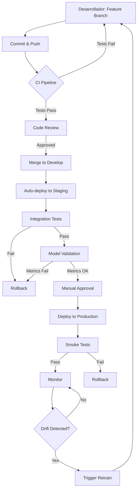

# Laboratorio 6: MLOps y Mejores Prácticas Operativas en Databricks

**Duración:** 1 hora

## Objetivo

Implementar un ciclo completo de vida de modelos y gobernanza usando Databricks y herramientas integradas, aplicando principios de MLOps para automatizar el desarrollo, despliegue y monitoreo de modelos de machine learning.

**Caso de Uso:** Implementación de prácticas MLOps para el modelo de predicción de energía renovable (`renewable_energy_predictor`) usando el dataset `owid-energy-data.csv`, incluyendo CI/CD, versionado, automatización y gobernanza.

---

## Prerequisitos

- Laboratorios 4 y 5 completados (modelo de energía renovable entrenado y desplegado)
- Azure Databricks workspace configurado
- Dataset `owid-energy-data.csv` en DBFS
- Cuenta de GitHub o Azure DevOps
- Familiaridad con Git y CI/CD
- Permisos para crear workflows y jobs

---

## Parte 1: Introducción a MLOps

### 1.1 ¿Qué es MLOps?

**MLOps (Machine Learning Operations)** es una práctica que combina Machine Learning, DevOps y Data Engineering para:

- **Automatizar** el ciclo de vida completo de ML
- **Estandarizar** procesos de desarrollo y despliegue
- **Monitorear** modelos en producción
- **Garantizar** reproducibilidad y gobernanza
- **Acelerar** el time-to-market de modelos

### 1.2 Ciclo de Vida de MLOps

```
┌─────────────────────────────────────────────────────────────────┐
│                    CICLO DE VIDA DE MLOPS                       │
└─────────────────────────────────────────────────────────────────┘

1. DESARROLLO               2. EXPERIMENTACIÓN         3. VALIDACIÓN
   ├─ Exploración datos        ├─ Feature Engineering     ├─ Testing
   ├─ Análisis                 ├─ Entrenamiento          ├─ Validación
   └─ Preparación              └─ Tracking (MLflow)      └─ Aprobación
                                                         
            ↓                           ↓                      ↓

4. DESPLIEGUE              5. MONITOREO               6. REENTRENAMIENTO
   ├─ CI/CD Pipeline          ├─ Performance             ├─ Drift Detection
   ├─ Staging                 ├─ Drift                   ├─ Auto-trigger
   └─ Production              └─ Alertas                 └─ Validación
```

### 1.3 Componentes Clave en Databricks

| Componente | Propósito | Herramienta |
|------------|-----------|-------------|
| **Version Control** | Código y notebooks | GitHub, Azure DevOps |
| **Experiment Tracking** | Registro de experimentos | MLflow |
| **Model Registry** | Gestión de modelos | MLflow Registry |
| **CI/CD** | Automatización | GitHub Actions, Azure Pipelines |
| **Orchestration** | Workflows | Databricks Jobs, Workflows |
| **Monitoring** | Observabilidad | MLflow, Delta Lake |
| **Feature Store** | Gestión de features | Databricks Feature Store |

---

## Parte 2: Control de Versiones e Integración con Git

### 2.1 Configurar Repositorio Git en Databricks

#### Paso 1: Conectar Databricks con GitHub

```markdown
**En la interfaz de Databricks:**

1. Ir a **User Settings** → **Git Integration**
2. Seleccionar **GitHub** como proveedor
3. Generar Personal Access Token en GitHub:
   - Settings → Developer settings → Personal access tokens
   - Scopes: `repo`, `workflow`
4. Pegar token en Databricks
5. Guardar configuración

✓ Conexión establecida con GitHub
```

#### Paso 2: Clonar Repositorio en Databricks

```python
# Databricks notebook source
# MAGIC %md
# MAGIC ## Configuración de Git en Databricks

# COMMAND ----------

# MAGIC %md
# MAGIC ### Clonar repositorio usando Git Folders

# COMMAND ----------

# Información del repositorio
REPO_URL = "https://github.com/your-org/ml-project.git"
REPO_PATH = "/Repos/Production/ml-project"

# En Databricks UI:
# 1. Workspace → Repos → Add Repo
# 2. Git repository URL: [URL del repo]
# 3. Git provider: GitHub
# 4. Repository name: ml-project

print(f"✓ Repositorio clonado en: {REPO_PATH}")

# COMMAND ----------

# MAGIC %md
# MAGIC ### Estructura de directorios recomendada

# COMMAND ----------

# MAGIC %md
# MAGIC ```
# MAGIC ml-project/
# MAGIC ├── notebooks/
# MAGIC │   ├── 01_data_preparation.py
# MAGIC │   ├── 02_feature_engineering.py
# MAGIC │   ├── 03_model_training.py
# MAGIC │   └── 04_model_evaluation.py
# MAGIC ├── src/
# MAGIC │   ├── data/
# MAGIC │   │   └── loader.py
# MAGIC │   ├── features/
# MAGIC │   │   └── engineering.py
# MAGIC │   ├── models/
# MAGIC │   │   └── trainer.py
# MAGIC │   └── utils/
# MAGIC │       └── helpers.py
# MAGIC ├── tests/
# MAGIC │   ├── test_data.py
# MAGIC │   ├── test_features.py
# MAGIC │   └── test_models.py
# MAGIC ├── config/
# MAGIC │   ├── dev.yaml
# MAGIC │   ├── staging.yaml
# MAGIC │   └── prod.yaml
# MAGIC ├── .github/
# MAGIC │   └── workflows/
# MAGIC │       ├── ci.yml
# MAGIC │       └── cd.yml
# MAGIC ├── requirements.txt
# MAGIC ├── setup.py
# MAGIC └── README.md
# MAGIC ```
```

### 2.2 Buenas Prácticas de Git para ML

```python
# COMMAND ----------

# MAGIC %md
# MAGIC ## Buenas Prácticas de Versionado

# COMMAND ----------

# MAGIC %md
# MAGIC ### 1. Estrategia de Branching
# MAGIC 
# MAGIC **Git Flow para ML:**
# MAGIC 
# MAGIC - `main`: Código en producción
# MAGIC - `develop`: Desarrollo activo
# MAGIC - `feature/*`: Nuevas características
# MAGIC - `experiment/*`: Experimentos de ML
# MAGIC - `hotfix/*`: Correcciones urgentes
# MAGIC 
# MAGIC **Ejemplo de workflow:**
# MAGIC ```bash
# MAGIC # Crear rama de experimento
# MAGIC git checkout -b experiment/improve-accuracy
# MAGIC 
# MAGIC # Desarrollar y commitear
# MAGIC git add notebooks/03_model_training.py
# MAGIC git commit -m "feat: add xgboost model variant"
# MAGIC 
# MAGIC # Push y crear PR
# MAGIC git push origin experiment/improve-accuracy
# MAGIC ```

# COMMAND ----------

# MAGIC %md
# MAGIC ### 2. Commits Semánticos
# MAGIC 
# MAGIC ```
# MAGIC feat: nueva funcionalidad
# MAGIC fix: corrección de bug
# MAGIC data: cambios en datos o schemas
# MAGIC model: cambios en arquitectura de modelo
# MAGIC config: cambios en configuración
# MAGIC test: añadir o modificar tests
# MAGIC docs: documentación
# MAGIC refactor: refactorización sin cambio funcional
# MAGIC ```
# MAGIC 
# MAGIC **Ejemplos:**
# MAGIC ```
# MAGIC feat: add ensemble model with voting classifier
# MAGIC fix: correct feature scaling in preprocessing pipeline
# MAGIC data: update schema for new customer attributes
# MAGIC model: increase tree depth from 10 to 15
# MAGIC ```

# COMMAND ----------

# MAGIC %md
# MAGIC ### 3. ¿Qué NO versionar?
# MAGIC 
# MAGIC **Archivo `.gitignore` para proyectos ML:**

# COMMAND ----------

gitignore_content = """
# Databricks
.databricks/
*.egg-info/

# Python
__pycache__/
*.py[cod]
*$py.class
*.so
.Python
env/
venv/

# Jupyter / Notebooks
.ipynb_checkpoints
*.ipynb (outputs)

# MLflow
mlruns/
mlartifacts/

# Datos (NO versionar datos grandes)
data/raw/*
data/processed/*
*.csv (grandes)
*.parquet
*.pkl
*.h5
*.hdf5

# Modelos entrenados (usar MLflow Registry)
models/*.pkl
models/*.joblib
*.model

# Secretos y credenciales
.env
secrets.yaml
*.key
*.pem

# Temporales
.DS_Store
*.log
*.tmp
"""

print("📝 Contenido de .gitignore:")
print(gitignore_content)
```

### 2.3 Trabajo con Notebooks y Git

```python
# COMMAND ----------

# MAGIC %md
# MAGIC ## Convertir Notebooks a Scripts Python

# COMMAND ----------

# MAGIC %md
# MAGIC ### ¿Por qué convertir notebooks?
# MAGIC 
# MAGIC - ✅ Mejor diff en Git (formato texto)
# MAGIC - ✅ Code review más fácil
# MAGIC - ✅ CI/CD más robusto
# MAGIC - ✅ Testeable con pytest
# MAGIC - ✅ Modular y reutilizable

# COMMAND ----------

# Ejemplo: Exportar notebook a script Python
# dbutils.notebook.run("notebook_path", timeout_seconds, arguments)

# O usar CLI de Databricks:
# databricks workspace export_dir /Users/me/notebooks ./notebooks --format SOURCE

print("✓ Notebooks exportados a formato .py")

# COMMAND ----------

# MAGIC %md
# MAGIC ### Sincronizar cambios con Git

# COMMAND ----------

# MAGIC %sh
# MAGIC # Ver estado de cambios
# MAGIC cd /Workspace/Repos/Production/ml-project
# MAGIC git status
# MAGIC 
# MAGIC # Ver diferencias
# MAGIC git diff
# MAGIC 
# MAGIC # Agregar cambios
# MAGIC git add notebooks/
# MAGIC 
# MAGIC # Commit
# MAGIC git commit -m "feat: improve feature engineering pipeline"
# MAGIC 
# MAGIC # Push
# MAGIC git push origin feature/better-features
```

---

## Parte 3: CI/CD para Machine Learning

### 3.1 Pipeline de CI/CD con GitHub Actions

#### Configuración de GitHub Actions

**Archivo: `.github/workflows/ci-ml.yml`**

```yaml
name: ML CI Pipeline

on:
  pull_request:
    branches: [main, develop]
  push:
    branches: [main, develop]

env:
  DATABRICKS_HOST: ${{ secrets.DATABRICKS_HOST }}
  DATABRICKS_TOKEN: ${{ secrets.DATABRICKS_TOKEN }}

jobs:
  code-quality:
    name: Code Quality Checks
    runs-on: ubuntu-latest
    
    steps:
      - name: Checkout code
        uses: actions/checkout@v3
      
      - name: Set up Python
        uses: actions/setup-python@v4
        with:
          python-version: '3.9'
      
      - name: Install dependencies
        run: |
          pip install -r requirements.txt
          pip install flake8 black pytest
      
      - name: Lint with flake8
        run: |
          flake8 src/ --max-line-length=100 --ignore=E501,W503
      
      - name: Format check with black
        run: |
          black --check src/
      
      - name: Type checking with mypy
        run: |
          pip install mypy
          mypy src/ --ignore-missing-imports

  unit-tests:
    name: Unit Tests
    runs-on: ubuntu-latest
    needs: code-quality
    
    steps:
      - name: Checkout code
        uses: actions/checkout@v3
      
      - name: Set up Python
        uses: actions/setup-python@v4
        with:
          python-version: '3.9'
      
      - name: Install dependencies
        run: |
          pip install -r requirements.txt
          pip install pytest pytest-cov
      
      - name: Run tests with coverage
        run: |
          pytest tests/ -v --cov=src --cov-report=xml --cov-report=html
      
      - name: Upload coverage reports
        uses: codecov/codecov-action@v3
        with:
          file: ./coverage.xml

  integration-tests:
    name: Integration Tests on Databricks
    runs-on: ubuntu-latest
    needs: unit-tests
    
    steps:
      - name: Checkout code
        uses: actions/checkout@v3
      
      - name: Install Databricks CLI
        run: |
          pip install databricks-cli
      
      - name: Configure Databricks CLI
        run: |
          echo "[DEFAULT]" > ~/.databrickscfg
          echo "host = $DATABRICKS_HOST" >> ~/.databrickscfg
          echo "token = $DATABRICKS_TOKEN" >> ~/.databrickscfg
      
      - name: Run integration tests on Databricks
        run: |
          databricks workspace import_dir ./tests /Workspace/Shared/ci-tests --overwrite
          
          # Ejecutar notebook de tests
          RUN_ID=$(databricks runs submit --json '{
            "run_name": "CI Integration Tests",
            "new_cluster": {
              "spark_version": "13.3.x-scala2.12",
              "node_type_id": "Standard_DS3_v2",
              "num_workers": 1
            },
            "notebook_task": {
              "notebook_path": "/Workspace/Shared/ci-tests/integration_tests",
              "base_parameters": {}
            }
          }' | jq -r .run_id)
          
          # Esperar resultado
          databricks runs get --run-id $RUN_ID

  data-validation:
    name: Data Validation
    runs-on: ubuntu-latest
    needs: unit-tests
    
    steps:
      - name: Checkout code
        uses: actions/checkout@v3
      
      - name: Install dependencies
        run: |
          pip install great-expectations pandas
      
      - name: Run data validation
        run: |
          python scripts/validate_data.py

  model-validation:
    name: Model Performance Validation
    runs-on: ubuntu-latest
    needs: [integration-tests, data-validation]
    
    steps:
      - name: Checkout code
        uses: actions/checkout@v3
      
      - name: Install dependencies
        run: |
          pip install mlflow databricks-cli
      
      - name: Validate model performance
        run: |
          python scripts/validate_model.py \
            --model-name "renewable_energy_predictor" \
            --min-accuracy 0.70 \
            --max-latency-ms 200
        # Note: min-accuracy es R² score para regresión (0.70 = 70% variance explained)
```

### 3.2 Pipeline de CD (Continuous Deployment)

**Archivo: `.github/workflows/cd-ml.yml`**

```yaml
name: ML CD Pipeline

on:
  push:
    branches: [main]
    tags:
      - 'v*'

env:
  DATABRICKS_HOST: ${{ secrets.DATABRICKS_HOST }}
  DATABRICKS_TOKEN: ${{ secrets.DATABRICKS_TOKEN }}

jobs:
  deploy-to-staging:
    name: Deploy to Staging
    runs-on: ubuntu-latest
    environment: staging
    
    steps:
      - name: Checkout code
        uses: actions/checkout@v3
      
      - name: Install Databricks CLI
        run: pip install databricks-cli mlflow
      
      - name: Configure Databricks
        run: |
          echo "[DEFAULT]" > ~/.databrickscfg
          echo "host = $DATABRICKS_HOST" >> ~/.databrickscfg
          echo "token = $DATABRICKS_TOKEN" >> ~/.databrickscfg
      
      - name: Deploy notebooks to staging
        run: |
          databricks workspace import_dir ./notebooks /Workspace/Staging/ml-project --overwrite
      
      - name: Promote model to Staging
        run: |
          python scripts/promote_model.py \
            --model-name "renewable_energy_predictor" \
            --version ${{ github.sha }} \
            --stage "Staging"
      
      - name: Run smoke tests
        run: |
          python scripts/smoke_tests.py --env staging

  deploy-to-production:
    name: Deploy to Production
    runs-on: ubuntu-latest
    needs: deploy-to-staging
    environment: production
    
    steps:
      - name: Checkout code
        uses: actions/checkout@v3
      
      - name: Install dependencies
        run: pip install databricks-cli mlflow
      
      - name: Configure Databricks
        run: |
          echo "[DEFAULT]" > ~/.databrickscfg
          echo "host = $DATABRICKS_HOST" >> ~/.databrickscfg
          echo "token = $DATABRICKS_TOKEN" >> ~/.databrickscfg
      
      - name: Deploy notebooks to production
        run: |
          databricks workspace import_dir ./notebooks /Workspace/Production/ml-project --overwrite
      
      - name: Promote model to Production
        run: |
          python scripts/promote_model.py \
            --model-name "renewable_energy_predictor" \
            --version ${{ github.sha }} \
            --stage "Production"
      
      - name: Update production endpoint
        run: |
          python scripts/update_endpoint.py \
            --model-name "renewable_energy_predictor" \
            --endpoint "renewable-energy-prod-endpoint" \
            --traffic-percentage 100
      
      - name: Run production smoke tests
        run: |
          python scripts/smoke_tests.py --env production
      
      - name: Notify deployment
        run: |
          curl -X POST ${{ secrets.SLACK_WEBHOOK }} \
            -H 'Content-Type: application/json' \
            -d '{"text":"✅ Model deployed to production: renewable_energy_predictor"}'
```

### 3.3 Scripts de Automatización

#### Script: `scripts/promote_model.py`

```python
"""
Promoción automática de modelos entre stages
"""
import argparse
import mlflow
from mlflow.tracking import MlflowClient

def promote_model(model_name: str, version: str, stage: str):
    """
    Promueve modelo a un stage específico
    
    Args:
        model_name: Nombre del modelo en MLflow Registry
        version: Versión del modelo o 'latest'
        stage: Stage destino ('Staging', 'Production', 'Archived')
    """
    client = MlflowClient()
    
    # Obtener versión del modelo
    if version == 'latest':
        versions = client.search_model_versions(f"name='{model_name}'")
        latest_version = max([int(v.version) for v in versions])
        version = str(latest_version)
    
    print(f"Promoviendo {model_name} v{version} a {stage}...")
    
    # Validaciones pre-promoción
    model_version = client.get_model_version(model_name, version)
    
    if stage == "Production":
        # Verificar que pasó staging
        if model_version.current_stage != "Staging":
            raise ValueError(f"Modelo debe estar en Staging antes de Production")
        
        # Verificar tags requeridos
        required_tags = ["validation_passed", "security_scan"]
        for tag in required_tags:
            if tag not in model_version.tags:
                raise ValueError(f"Tag requerido '{tag}' no encontrado")
    
    # Transicionar stage
    client.transition_model_version_stage(
        name=model_name,
        version=version,
        stage=stage,
        archive_existing_versions=True
    )
    
    # Agregar metadata
    client.set_model_version_tag(model_name, version, "promoted_by", "ci_cd")
    client.set_model_version_tag(model_name, version, "promotion_date", 
                                 mlflow.utils.time.get_current_time_millis())
    
    print(f"✓ Modelo promovido exitosamente a {stage}")

if __name__ == "__main__":
    parser = argparse.ArgumentParser()
    parser.add_argument("--model-name", required=True)
    parser.add_argument("--version", default="latest")
    parser.add_argument("--stage", required=True, 
                       choices=["Staging", "Production", "Archived"])
    
    args = parser.parse_args()
    promote_model(args.model_name, args.version, args.stage)
```

#### Script: `scripts/validate_model.py`

```python
"""
Validación automática de modelos
"""
import argparse
import mlflow
from mlflow.tracking import MlflowClient
import pandas as pd
import time

def validate_model(model_name: str, min_accuracy: float, max_latency_ms: float):
    """
    Valida performance del modelo
    
    Args:
        model_name: Nombre del modelo
        min_accuracy: Accuracy mínimo requerido
        max_latency_ms: Latencia máxima permitida (ms)
    """
    client = MlflowClient()
    
    print(f"Validando modelo: {model_name}")
    
    # Obtener última versión
    versions = client.search_model_versions(f"name='{model_name}'")
    latest_version = max(versions, key=lambda x: int(x.version))
    
    # Cargar modelo
    model_uri = f"models:/{model_name}/{latest_version.version}"
    model = mlflow.pyfunc.load_model(model_uri)
    
    # 1. Validar R² score (métrica principal para regresión)
    run_id = latest_version.run_id
    run = client.get_run(run_id)
    r2_score = run.data.metrics.get('test_r2', 0)
    rmse = run.data.metrics.get('test_rmse', 0)
    
    print(f"📊 R² Score: {r2_score:.4f} (mínimo: {min_accuracy})")
    print(f"📊 RMSE: {rmse:.4f}%")
    
    if r2_score < min_accuracy:
        raise ValueError(f"R² Score {r2_score:.4f} está por debajo del mínimo {min_accuracy}")
    
    # 2. Validar latencia
    test_data = pd.DataFrame({
        'year': [2022], 
        'population': [50000000], 
        'gdp': [500000000000],
        'primary_energy_consumption': [1500],
        'fossil_fuel_consumption': [1200],
        'renewables_consumption': [300]
    })
    
    latencies = []
    for _ in range(10):
        start = time.time()
        _ = model.predict(test_data)
        latency = (time.time() - start) * 1000
        latencies.append(latency)
    
    avg_latency = sum(latencies) / len(latencies)
    p95_latency = sorted(latencies)[int(0.95 * len(latencies))]
    
    print(f"⏱️  Latencia promedio: {avg_latency:.2f}ms (máximo: {max_latency_ms}ms)")
    print(f"⏱️  Latencia P95: {p95_latency:.2f}ms")
    
    if p95_latency > max_latency_ms:
        raise ValueError(f"Latencia P95 {p95_latency:.2f}ms excede máximo {max_latency_ms}ms")
    
    # 3. Marcar como validado
    client.set_model_version_tag(model_name, latest_version.version, 
                                "validation_passed", "true")
    client.set_model_version_tag(model_name, latest_version.version,
                                "validated_r2_score", str(r2_score))
    client.set_model_version_tag(model_name, latest_version.version,
                                "validated_rmse", str(rmse))
    client.set_model_version_tag(model_name, latest_version.version,
                                "validated_latency_p95", str(p95_latency))
    
    print(f"✅ Validación completada exitosamente")

if __name__ == "__main__":
    parser = argparse.ArgumentParser()
    parser.add_argument("--model-name", required=True)
    parser.add_argument("--min-accuracy", type=float, default=0.70, 
                       help="Minimum R² score for regression model")
    parser.add_argument("--max-latency-ms", type=float, default=200)
    
    args = parser.parse_args()
    validate_model(args.model_name, args.min_accuracy, args.max_latency_ms)
```

---

## Parte 4: Automatización de Pipelines con Databricks Workflows

### 4.1 Crear Pipeline de Entrenamiento Automatizado

```python
# Databricks notebook source
# MAGIC %md
# MAGIC ## Pipeline Automatizado de ML

# COMMAND ----------

# MAGIC %md
# MAGIC ### Configuración del Pipeline

# COMMAND ----------

import json
from datetime import datetime

# Configuración del pipeline
PIPELINE_CONFIG = {
    "name": "ml-training-pipeline",
    "tasks": [
        {
            "task_key": "data_preparation",
            "notebook_path": "/Workspace/Production/ml-project/notebooks/01_data_preparation",
            "cluster_spec": {
                "spark_version": "13.3.x-scala2.12",
                "node_type_id": "Standard_DS3_v2",
                "num_workers": 2
            }
        },
        {
            "task_key": "feature_engineering",
            "depends_on": ["data_preparation"],
            "notebook_path": "/Workspace/Production/ml-project/notebooks/02_feature_engineering",
            "cluster_spec": {
                "spark_version": "13.3.x-scala2.12",
                "node_type_id": "Standard_DS3_v2",
                "num_workers": 2
            }
        },
        {
            "task_key": "model_training",
            "depends_on": ["feature_engineering"],
            "notebook_path": "/Workspace/Production/ml-project/notebooks/03_model_training",
            "cluster_spec": {
                "spark_version": "13.3.x-scala2.12",
                "node_type_id": "Standard_DS3_v2",
                "num_workers": 4,
                "spark_conf": {
                    "spark.databricks.delta.optimizeWrite.enabled": "true"
                }
            }
        },
        {
            "task_key": "model_evaluation",
            "depends_on": ["model_training"],
            "notebook_path": "/Workspace/Production/ml-project/notebooks/04_model_evaluation",
            "cluster_spec": {
                "spark_version": "13.3.x-scala2.12",
                "node_type_id": "Standard_DS3_v2",
                "num_workers": 2
            }
        },
        {
            "task_key": "model_registration",
            "depends_on": ["model_evaluation"],
            "notebook_path": "/Workspace/Production/ml-project/notebooks/05_model_registration",
            "cluster_spec": {
                "spark_version": "13.3.x-scala2.12",
                "node_type_id": "Standard_DS3_v2",
                "num_workers": 1
            }
        }
    ],
    "schedule": {
        "quartz_cron_expression": "0 0 2 * * ?",  # Diario a las 2 AM
        "timezone_id": "America/New_York"
    },
    "email_notifications": {
        "on_success": ["data-science-team@company.com"],
        "on_failure": ["data-science-team@company.com", "ops-team@company.com"]
    }
}

print(json.dumps(PIPELINE_CONFIG, indent=2))

# COMMAND ----------

# MAGIC %md
# MAGIC ### Crear Job usando Databricks Jobs API

# COMMAND ----------

from databricks.sdk import WorkspaceClient
from databricks.sdk.service import jobs

w = WorkspaceClient()

# Crear job programáticamente
job = w.jobs.create(
    name=PIPELINE_CONFIG["name"],
    tasks=[
        jobs.Task(
            task_key=task["task_key"],
            depends_on=[jobs.TaskDependency(task_key=dep) for dep in task.get("depends_on", [])],
            notebook_task=jobs.NotebookTask(
                notebook_path=task["notebook_path"],
                base_parameters={}
            ),
            new_cluster=jobs.ClusterSpec(
                spark_version=task["cluster_spec"]["spark_version"],
                node_type_id=task["cluster_spec"]["node_type_id"],
                num_workers=task["cluster_spec"]["num_workers"],
                spark_conf=task["cluster_spec"].get("spark_conf", {})
            )
        )
        for task in PIPELINE_CONFIG["tasks"]
    ],
    schedule=jobs.CronSchedule(
        quartz_cron_expression=PIPELINE_CONFIG["schedule"]["quartz_cron_expression"],
        timezone_id=PIPELINE_CONFIG["schedule"]["timezone_id"]
    ),
    email_notifications=jobs.JobEmailNotifications(
        on_success=PIPELINE_CONFIG["email_notifications"]["on_success"],
        on_failure=PIPELINE_CONFIG["email_notifications"]["on_failure"]
    )
)

print(f"✓ Job creado con ID: {job.job_id}")
print(f"URL: https://<databricks-instance>/#job/{job.job_id}")

# COMMAND ----------

# MAGIC %md
# MAGIC ### Ejecutar Job Manualmente

# COMMAND ----------

# Ejecutar job
run = w.jobs.run_now(job_id=job.job_id)

print(f"✓ Job ejecutado - Run ID: {run.run_id}")
print(f"Monitorear en: https://<databricks-instance>/#job/{job.job_id}/run/{run.run_id}")
```

### 4.2 Pipeline de Reentrenamiento Automático

```python
# COMMAND ----------

# MAGIC %md
# MAGIC ## Pipeline de Reentrenamiento Basado en Drift

# COMMAND ----------

# MAGIC %md
# MAGIC ### Notebook: Drift Detection y Trigger

# COMMAND ----------

import mlflow
from mlflow.tracking import MlflowClient
from scipy import stats
import pandas as pd

def check_drift_and_retrain(model_name: str, drift_threshold: float = 0.05):
    """
    Verifica drift y dispara reentrenamiento si es necesario
    """
    client = MlflowClient()
    
    # 1. Obtener datos de referencia (training)
    reference_data = spark.read.format("delta").load("/delta/energy_features").toPandas()
    
    # 2. Obtener datos de producción recientes
    production_data = spark.read.format("delta") \
        .load("/mnt/ml-monitoring/prediction-logs") \
        .filter("timestamp >= current_date() - 7") \
        .toPandas()
    
    # 3. Detectar drift
    features = ['year', 'population', 'gdp', 'primary_energy_consumption', 
                'fossil_fuel_consumption', 'renewables_consumption']
    drift_detected = False
    drift_features = []
    
    for feature in features:
        _, p_value = stats.ks_2samp(
            reference_data[feature],
            production_data[feature]
        )
        
        if p_value < drift_threshold:
            drift_detected = True
            drift_features.append(feature)
            print(f"⚠️ Drift detectado en '{feature}': p-value={p_value:.4f}")
    
    # 4. Registrar detección
    with mlflow.start_run(run_name="drift_detection"):
        mlflow.log_param("model_name", model_name)
        mlflow.log_param("drift_threshold", drift_threshold)
        mlflow.log_metric("drift_features_count", len(drift_features))
        mlflow.log_metric("drift_detected", 1 if drift_detected else 0)
        
        for feature in drift_features:
            mlflow.set_tag(f"drift_feature_{feature}", "true")
    
    # 5. Disparar reentrenamiento si hay drift
    if drift_detected:
        print(f"\n🔄 Disparando reentrenamiento automático...")
        print(f"Features con drift: {', '.join(drift_features)}")
        
        # Disparar job de reentrenamiento
        from databricks.sdk import WorkspaceClient
        w = WorkspaceClient()
        
        # Buscar job de reentrenamiento
        jobs_list = w.jobs.list(name="ml-training-pipeline")
        training_job = next(jobs_list, None)
        
        if training_job:
            run = w.jobs.run_now(
                job_id=training_job.job_id,
                notebook_params={
                    "retrain_reason": "drift_detected",
                    "drift_features": ",".join(drift_features)
                }
            )
            print(f"✓ Job de reentrenamiento iniciado: Run ID {run.run_id}")
        else:
            print("⚠️ Job de reentrenamiento no encontrado")
    else:
        print("✓ No se detectó drift significativo")
    
    return drift_detected, drift_features

# Ejecutar verificación
drift_detected, drift_features = check_drift_and_retrain("renewable_energy_predictor")

# COMMAND ----------

# MAGIC %md
# MAGIC ### Programar Verificación Periódica de Drift

# COMMAND ----------

# Crear job para monitoreo de drift
drift_monitoring_job = w.jobs.create(
    name="drift-monitoring-daily",
    tasks=[
        jobs.Task(
            task_key="check_drift",
            notebook_task=jobs.NotebookTask(
                notebook_path="/Workspace/Production/ml-project/notebooks/drift_detection",
                base_parameters={
                    "model_name": "renewable_energy_predictor",
                    "drift_threshold": "0.05"
                }
            ),
            new_cluster=jobs.ClusterSpec(
                spark_version="13.3.x-scala2.12",
                node_type_id="Standard_DS3_v2",
                num_workers=1
            )
        )
    ],
    schedule=jobs.CronSchedule(
        quartz_cron_expression="0 0 8 * * ?",  # Diario a las 8 AM
        timezone_id="UTC"
    ),
    email_notifications=jobs.JobEmailNotifications(
        on_failure=["ml-ops-team@company.com"]
    )
)

print(f"✓ Job de monitoreo de drift creado: {drift_monitoring_job.job_id}")
```

---

## Parte 5: Gobernanza y Control de Acceso

### 5.1 Unity Catalog para Gobernanza de Datos

```python
# COMMAND ----------

# MAGIC %md
# MAGIC ## Gobernanza con Unity Catalog

# COMMAND ----------

# MAGIC %md
# MAGIC ### Estructura de Unity Catalog

# COMMAND ----------

# MAGIC %md
# MAGIC ```
# MAGIC Unity Catalog
# MAGIC ├── Catalog: ml_production
# MAGIC │   ├── Schema: raw_data
# MAGIC │   │   ├── Table: customer_data
# MAGIC │   │   └── Table: transactions
# MAGIC │   ├── Schema: features
# MAGIC │   │   ├── Table: customer_features
# MAGIC │   │   └── Table: transaction_features
# MAGIC │   ├── Schema: models
# MAGIC │   │   └── Table: model_predictions
# MAGIC │   └── Schema: monitoring
# MAGIC │       ├── Table: prediction_logs
# MAGIC │       └── Table: drift_metrics
# MAGIC ```

# COMMAND ----------

# MAGIC %md
# MAGIC ### Configurar Permisos y Accesos

# COMMAND ----------

# Crear catálogo
spark.sql("CREATE CATALOG IF NOT EXISTS ml_production")
spark.sql("USE CATALOG ml_production")

# Crear schemas
spark.sql("CREATE SCHEMA IF NOT EXISTS raw_data")
spark.sql("CREATE SCHEMA IF NOT EXISTS features")
spark.sql("CREATE SCHEMA IF NOT EXISTS models")
spark.sql("CREATE SCHEMA IF NOT EXISTS monitoring")

print("✓ Estructura de catálogos creada")

# COMMAND ----------

# MAGIC %md
# MAGIC ### Aplicar Políticas de Acceso

# COMMAND ----------

# MAGIC %sql
# MAGIC -- Dar permisos de lectura a data scientists
# MAGIC GRANT SELECT ON SCHEMA ml_production.raw_data TO `data-scientists`;
# MAGIC GRANT SELECT ON SCHEMA ml_production.features TO `data-scientists`;
# MAGIC 
# MAGIC -- Dar permisos de escritura a pipelines de ML
# MAGIC GRANT ALL PRIVILEGES ON SCHEMA ml_production.features TO `ml-pipelines`;
# MAGIC GRANT ALL PRIVILEGES ON SCHEMA ml_production.models TO `ml-pipelines`;
# MAGIC 
# MAGIC -- Solo admins pueden modificar raw_data
# MAGIC GRANT ALL PRIVILEGES ON SCHEMA ml_production.raw_data TO `data-admins`;
# MAGIC 
# MAGIC -- Auditoría: todos pueden leer monitoring
# MAGIC GRANT SELECT ON SCHEMA ml_production.monitoring TO `all-users`;

# COMMAND ----------

# MAGIC %md
# MAGIC ### Data Lineage y Auditoría

# COMMAND ----------

# MAGIC %sql
# MAGIC -- Ver lineage de una tabla
# MAGIC DESCRIBE EXTENDED ml_production.models.model_predictions;
# MAGIC 
# MAGIC -- Ver historial de cambios
# MAGIC DESCRIBE HISTORY ml_production.models.model_predictions;
# MAGIC 
# MAGIC -- Auditar accesos
# MAGIC SELECT * FROM system.access.audit
# MAGIC WHERE table_name = 'model_predictions'
# MAGIC   AND event_time >= current_date() - 7
# MAGIC ORDER BY event_time DESC;
```

### 5.2 Versionado de Datos

```python
# COMMAND ----------

# MAGIC %md
# MAGIC ## Versionado de Datasets con Delta Lake

# COMMAND ----------

# MAGIC %md
# MAGIC ### Time Travel en Delta Lake

# COMMAND ----------

# Guardar versión del dataset de entrenamiento
training_data_path = "/delta/energy_features"
version_tag = "v2024-12-11"

# Escribir datos con metadata
(spark.read.format("delta").load("/FileStore/tables/owid-energy-data.csv")
 .write
 .format("delta")
 .mode("overwrite")
 .option("userMetadata", f"version={version_tag},purpose=training")
 .save(training_data_path))

print(f"✓ Dataset versionado: {version_tag}")

# COMMAND ----------

# MAGIC %md
# MAGIC ### Registrar Versión en MLflow

# COMMAND ----------

import mlflow

# Registrar metadata del dataset
with mlflow.start_run(run_name="dataset_versioning"):
    mlflow.log_param("dataset_path", training_data_path)
    mlflow.log_param("dataset_version", version_tag)
    mlflow.log_param("dataset_rows", spark.read.format("delta").load(training_data_path).count())
    
    # Registrar schema
    schema_json = spark.read.format("delta").load(training_data_path).schema.json()
    mlflow.log_text(schema_json, "dataset_schema.json")
    
    # Registrar estadísticas
    stats = spark.read.format("delta").load(training_data_path).describe().toPandas()
    mlflow.log_text(stats.to_csv(index=False), "dataset_stats.csv")

print("✓ Metadata del dataset registrada en MLflow")

# COMMAND ----------

# MAGIC %md
# MAGIC ### Acceder a Versiones Anteriores

# COMMAND ----------

# Time travel: leer versión específica
df_version_1 = spark.read.format("delta").option("versionAsOf", 1).load(training_data_path)
print(f"Versión 1: {df_version_1.count()} registros")

# Time travel: leer snapshot por timestamp
df_yesterday = spark.read.format("delta") \
    .option("timestampAsOf", "2024-12-10") \
    .load(training_data_path)

# Ver historial completo
history_df = spark.sql(f"DESCRIBE HISTORY delta.`{training_data_path}`")
display(history_df)

# COMMAND ----------

# MAGIC %md
# MAGIC ### Reproducibilidad de Experimentos

# COMMAND ----------

def train_model_with_versioning(dataset_version: str, model_params: dict):
    """
    Entrena modelo con dataset versionado para reproducibilidad
    """
    with mlflow.start_run(run_name=f"training_{dataset_version}"):
        # Registrar versión del dataset
        mlflow.log_param("dataset_version", dataset_version)
        
        # Cargar dataset específico
        df = spark.read.format("delta").option("versionAsOf", dataset_version).load(training_data_path)
        
        # Entrenar modelo
        # ... código de entrenamiento ...
        
        # Registrar hash del dataset para verificación
        import hashlib
        dataset_hash = hashlib.sha256(df.toPandas().to_json().encode()).hexdigest()[:16]
        mlflow.log_param("dataset_hash", dataset_hash)
        
        print(f"✓ Modelo entrenado con dataset version {dataset_version}")
        print(f"Dataset hash: {dataset_hash}")

# Ejemplo
# train_model_with_versioning("1", {"max_depth": 10})
```

---

## Parte 6: Monitoreo de Costos y Performance

### 6.1 Tracking de Costos

```python
# COMMAND ----------

# MAGIC %md
# MAGIC ## Monitoreo de Costos de MLOps

# COMMAND ----------

# MAGIC %md
# MAGIC ### Calcular Costos de Entrenamiento

# COMMAND ----------

import pandas as pd
from datetime import datetime, timedelta

def calculate_training_costs(job_id: str, days: int = 30):
    """
    Calcula costos de entrenamiento basado en uso de clusters
    """
    # Costos por hora (ejemplo Azure)
    COSTS = {
        "Standard_DS3_v2": 0.15,  # USD/hora
        "Standard_DS4_v2": 0.30,
        "Standard_DS5_v2": 0.60
    }
    
    # Obtener runs del job
    w = WorkspaceClient()
    runs = w.jobs.list_runs(job_id=job_id, completed_only=True, limit=100)
    
    total_cost = 0
    cost_breakdown = []
    
    for run in runs:
        if not run.start_time:
            continue
        
        # Filtrar por fecha
        run_date = datetime.fromtimestamp(run.start_time / 1000)
        if (datetime.now() - run_date).days > days:
            continue
        
        # Calcular duración
        duration_ms = (run.end_time or datetime.now().timestamp() * 1000) - run.start_time
        duration_hours = duration_ms / (1000 * 60 * 60)
        
        # Obtener tipo de nodo (simplificado)
        node_type = "Standard_DS3_v2"  # Obtener del cluster spec
        num_workers = 2  # Obtener del cluster spec
        
        # Calcular costo
        cost_per_hour = COSTS.get(node_type, 0.15)
        run_cost = duration_hours * cost_per_hour * (num_workers + 1)  # workers + driver
        
        total_cost += run_cost
        cost_breakdown.append({
            'run_id': run.run_id,
            'start_time': run_date,
            'duration_hours': duration_hours,
            'node_type': node_type,
            'num_workers': num_workers,
            'cost_usd': run_cost
        })
    
    # Crear DataFrame de resumen
    df_costs = pd.DataFrame(cost_breakdown)
    
    print(f"💰 Costos de Entrenamiento ({days} días)")
    print(f"Total: ${total_cost:.2f} USD")
    print(f"Promedio por run: ${total_cost / len(cost_breakdown):.2f} USD")
    print(f"Runs analizados: {len(cost_breakdown)}")
    
    return df_costs, total_cost

# Ejemplo
# df_costs, total = calculate_training_costs("job-123", days=30)
# display(df_costs)

# COMMAND ----------

# MAGIC %md
# MAGIC ### Optimización de Costos

# COMMAND ----------

# MAGIC %md
# MAGIC **Estrategias para Reducir Costos:**
# MAGIC 
# MAGIC 1. **Auto-scaling de Clusters**
# MAGIC    - Habilitar auto-scaling para ajustar workers dinámicamente
# MAGIC    - Configurar min/max workers según carga
# MAGIC 
# MAGIC 2. **Spot Instances**
# MAGIC    - Usar Azure Spot VMs para jobs no críticos
# MAGIC    - Ahorro de hasta 80% en costos
# MAGIC 
# MAGIC 3. **Job Clusters vs All-Purpose Clusters**
# MAGIC    - Usar job clusters que se apagan automáticamente
# MAGIC    - Evitar all-purpose clusters 24/7
# MAGIC 
# MAGIC 4. **Optimización de Código**
# MAGIC    - Cache de datos intermedios
# MAGIC    - Filtrado temprano de datos
# MAGIC    - Particionamiento eficiente
# MAGIC 
# MAGIC 5. **Programación Inteligente**
# MAGIC    - Entrenar en horarios de bajo costo
# MAGIC    - Batch processing nocturno
# MAGIC    - Reentrenamiento incremental vs completo

# COMMAND ----------

# Ejemplo: Configurar cluster con optimización de costos
OPTIMIZED_CLUSTER_CONFIG = {
    "cluster_name": "ml-training-optimized",
    "spark_version": "13.3.x-scala2.12",
    "node_type_id": "Standard_DS3_v2",
    "autoscale": {
        "min_workers": 1,
        "max_workers": 4
    },
    "autotermination_minutes": 30,
    "enable_elastic_disk": True,
    "azure_attributes": {
        "availability": "SPOT_AZURE",  # Usar Spot instances
        "first_on_demand": 1,  # Al menos 1 nodo on-demand
        "spot_bid_max_price": -1  # Precio máximo = precio on-demand
    },
    "spark_conf": {
        "spark.databricks.delta.optimizeWrite.enabled": "true",
        "spark.databricks.delta.autoCompact.enabled": "true"
    }
}

print("💡 Configuración de cluster optimizado:")
print(json.dumps(OPTIMIZED_CLUSTER_CONFIG, indent=2))
```

### 6.2 Dashboards de Monitoreo Operacional

```python
# COMMAND ----------

# MAGIC %md
# MAGIC ## Dashboard de KPIs de MLOps

# COMMAND ----------

# MAGIC %md
# MAGIC ### Métricas Clave de MLOps

# COMMAND ----------

import matplotlib.pyplot as plt
import seaborn as sns

def generate_mlops_dashboard():
    """
    Genera dashboard con KPIs de MLOps
    """
    # Simular métricas (en producción vendrían de logs reales)
    metrics = {
        'deployment_frequency': 12,  # deploys por mes
        'lead_time_hours': 4,  # tiempo de dev a producción
        'mttr_hours': 2,  # Mean Time To Recovery
        'change_failure_rate': 0.05,  # tasa de fallo de cambios
        'model_accuracy': 0.89,
        'model_latency_p95': 145,  # ms
        'training_cost_monthly': 450,  # USD
        'inference_cost_monthly': 280  # USD
    }
    
    fig, axes = plt.subplots(2, 3, figsize=(18, 10))
    fig.suptitle('MLOps Dashboard - KPIs', fontsize=16, fontweight='bold')
    
    # 1. Deployment Frequency
    axes[0, 0].bar(['Deploys/Mes'], [metrics['deployment_frequency']], color='#2ecc71')
    axes[0, 0].set_title('Deployment Frequency')
    axes[0, 0].set_ylabel('Count')
    axes[0, 0].axhline(y=10, color='r', linestyle='--', label='Target')
    axes[0, 0].legend()
    
    # 2. Lead Time
    axes[0, 1].bar(['Lead Time'], [metrics['lead_time_hours']], color='#3498db')
    axes[0, 1].set_title('Lead Time (Dev → Prod)')
    axes[0, 1].set_ylabel('Hours')
    axes[0, 1].axhline(y=6, color='r', linestyle='--', label='Target')
    axes[0, 1].legend()
    
    # 3. MTTR
    axes[0, 2].bar(['MTTR'], [metrics['mttr_hours']], color='#e74c3c')
    axes[0, 2].set_title('Mean Time To Recovery')
    axes[0, 2].set_ylabel('Hours')
    axes[0, 2].axhline(y=4, color='r', linestyle='--', label='Target')
    axes[0, 2].legend()
    
    # 4. Model Performance
    axes[1, 0].bar(['Accuracy', 'Target'], 
                   [metrics['model_accuracy'], 0.85], 
                   color=['#2ecc71', '#95a5a6'])
    axes[1, 0].set_title('Model Accuracy')
    axes[1, 0].set_ylim([0.8, 1.0])
    
    # 5. Latency
    axes[1, 1].bar(['P95 Latency', 'Target'], 
                   [metrics['model_latency_p95'], 200],
                   color=['#3498db', '#95a5a6'])
    axes[1, 1].set_title('Inference Latency (ms)')
    
    # 6. Costos
    costs = [metrics['training_cost_monthly'], metrics['inference_cost_monthly']]
    axes[1, 2].pie(costs, labels=['Training', 'Inference'], autopct='%1.1f%%',
                   colors=['#e74c3c', '#f39c12'])
    axes[1, 2].set_title(f'Monthly Costs: ${sum(costs)} USD')
    
    plt.tight_layout()
    plt.savefig('/tmp/mlops_dashboard.png', dpi=100, bbox_inches='tight')
    display(plt.gcf())
    
    # Registrar en MLflow
    with mlflow.start_run(run_name="mlops_metrics"):
        for key, value in metrics.items():
            mlflow.log_metric(key, value)
        mlflow.log_artifact('/tmp/mlops_dashboard.png')
    
    print("✓ Dashboard de MLOps generado")

generate_mlops_dashboard()
```

---

## Parte 7: Ejemplo Completo - Pipeline End-to-End

### 7.1 Proyecto de Referencia

**Estructura completa del proyecto:**

```
ml-renewable-energy-prediction/
├── .github/
│   └── workflows/
│       ├── ci.yml
│       └── cd.yml
├── notebooks/
│   ├── 01_data_preparation.py
│   ├── 02_feature_engineering.py
│   ├── 03_model_training.py
│   ├── 04_model_evaluation.py
│   ├── 05_model_registration.py
│   └── 06_drift_detection.py
├── src/
│   ├── __init__.py
│   ├── data/
│   │   ├── __init__.py
│   │   └── loader.py
│   ├── features/
│   │   ├── __init__.py
│   │   └── engineering.py
│   ├── models/
│   │   ├── __init__.py
│   │   ├── trainer.py
│   │   └── evaluator.py
│   └── utils/
│       ├── __init__.py
│       └── helpers.py
├── tests/
│   ├── test_data.py
│   ├── test_features.py
│   └── test_models.py
├── scripts/
│   ├── promote_model.py
│   ├── validate_model.py
│   ├── update_endpoint.py
│   └── smoke_tests.py
├── config/
│   ├── dev.yaml
│   ├── staging.yaml
│   └── prod.yaml
├── requirements.txt
├── setup.py
├── .gitignore
└── README.md
```

### 7.2 Flujo Completo de Trabajo



---

## Ejercicios Prácticos

### Ejercicio 1: Implementar CI/CD Completo

**Objetivo:** Configurar pipeline completo de CI/CD con GitHub Actions

**Tareas:**
1. Crear repositorio en GitHub
2. Configurar GitHub Actions para CI (tests, linting)
3. Configurar CD para despliegue automático
4. Implementar promoción de modelos entre stages
5. Probar flujo completo con un cambio

### Ejercicio 2: Pipeline de Reentrenamiento Automático

**Objetivo:** Implementar pipeline que detecte drift y retraine automáticamente

**Tareas:**
1. Crear job de monitoreo de drift diario
2. Implementar lógica de decisión para reentrenamiento
3. Configurar pipeline de entrenamiento parametrizado
4. Integrar validación automática post-entrenamiento
5. Configurar notificaciones de alertas

### Ejercicio 3: Dashboard de Gobernanza

**Objetivo:** Crear dashboard para auditoría y gobernanza

**Tareas:**
1. Configurar Unity Catalog con permisos
2. Implementar versionado de datasets
3. Crear dashboard de métricas de MLOps
4. Implementar tracking de costos
5. Generar reportes de auditoría

---

## Mejores Prácticas de MLOps

### ✅ DO: Hacer

1. **Versionado Completo**
   - Código, datos, modelos, y configuración
   - Usar Git para código, Delta Lake para datos, MLflow para modelos

2. **Automatización**
   - CI/CD para todo el pipeline
   - Tests automáticos en cada commit
   - Validación automática de modelos

3. **Monitoreo Continuo**
   - Drift, performance, costos
   - Alertas proactivas
   - Dashboards en tiempo real

4. **Reproducibilidad**
   - Entornos consistentes (containers, conda)
   - Seeds fijos para experimentos
   - Documentación exhaustiva

5. **Seguridad y Gobernanza**
   - Control de acceso granular
   - Auditoría de cambios
   - Encriptación de datos sensibles

### ❌ DON'T: Evitar

1. **Manual Deployment**
   - No desplegar modelos manualmente
   - Siempre usar pipelines automatizados

2. **Entrenar en All-Purpose Clusters**
   - Usar job clusters que se apagan
   - Evitar clusters 24/7 para desarrollo

3. **Ignorer Drift**
   - Monitorear activamente
   - Reentrenar cuando sea necesario

4. **Código en Notebooks sin Versionado**
   - Convertir a scripts Python
   - Versionar en Git

5. **Sin Tests**
   - Implementar tests unitarios y de integración
   - Validar antes de desplegar

---

## Recursos Adicionales

### Documentación Oficial

- [Databricks MLOps Guide](https://docs.databricks.com/mlops/index.html)
- [MLflow Documentation](https://mlflow.org/docs/latest/index.html)
- [Unity Catalog Best Practices](https://docs.databricks.com/data-governance/unity-catalog/best-practices.html)
- [Databricks Jobs API](https://docs.databricks.com/dev-tools/api/latest/jobs.html)

### Herramientas y Frameworks

- **GitHub Actions**: CI/CD para MLOps
- **Azure DevOps**: Alternativa para CI/CD
- **Great Expectations**: Validación de datos
- **Evidently AI**: Monitoreo de drift
- **Terraform**: Infrastructure as Code para Databricks

### Libros y Recursos

- "Machine Learning Engineering" - Andriy Burkov
- "Building Machine Learning Powered Applications" - Emmanuel Ameisen
- "Introducing MLOps" - Mark Treveil et al.

---

## Conclusión

En este laboratorio has aprendido a:

✅ **Configurar control de versiones** con Git y Databricks Repos  
✅ **Implementar CI/CD** para pipelines de ML con GitHub Actions  
✅ **Automatizar workflows** con Databricks Jobs y orquestación  
✅ **Aplicar gobernanza** con Unity Catalog y control de acceso  
✅ **Monitorear costos** y optimizar recursos  
✅ **Implementar reentrenamiento automático** basado en drift  
✅ **Seguir mejores prácticas** de MLOps en producción  

### Próximos Pasos

1. **Implementar en tu organización**
   - Adaptar pipelines a tus casos de uso
   - Configurar gobernanza según políticas internas

2. **Explorar temas avanzados**
   - Feature Store de Databricks
   - A/B testing automatizado
   - Explainabilidad de modelos (SHAP)

3. **Certificación**
   - Databricks Certified Machine Learning Professional
   - Azure Data Scientist Associate

---

**¡Felicitaciones!** Has completado el laboratorio de MLOps y Mejores Prácticas Operativas. Ahora tienes las habilidades para implementar un ciclo completo de vida de modelos con automatización, gobernanza y monitoreo continuo.
